# 利用 Tyk、Stripe 和 Moesif 实现端到端 API 货币化

> 原文:[https://www . Moesif . com/blog/technical/Stripe/Tyk/End-To-End-API-Monetization-With-Tyk-Stripe-And-Moesif/](https://www.moesif.com/blog/technical/stripe/tyk/End-To-End-API-Monetization-With-Tyk-Stripe-And-Moesif/)

许多 API 开发者和公司都在努力寻找简单的方法来建立系统，以使他们的 API 货币化。有些很简单，但不可定制，有些很复杂，需要大量的工程工作才能真正运行起来。

为了让事情变得更容易，Moesif 几个月前创建了一个名为**计费表**的功能，它提供了巨大的可定制性，但只需要最少的代码和工程工作。

对于这个实际上可以开箱即用的例子，我们将使用 Moesif、Tyk 和 Stripe 向用户收取 API 使用费。对于这种设置，有一些假设:

*   您有一个正在运行的 Tyk 实例(已经创建了一个 API 端点)
*   Tyk 中的 API 端点**认证模式**被设置为认证令牌
*   您有一个有效的 Stripe 帐户
*   您有一个有效的 Moesif 帐户
*   您已经在 Tyk 中安装并配置了 Moesif 插件

从外观上看，设置非常简单。我们将创建一个 **/register** 端点，它:

*   在条带中注册用户
*   为该用户订阅产品
*   在 Moesif 中注册用户和公司
*   使用 Tyk 生成 API 密钥

我还为它创建了一个小小的前端，它是一个简单的表单，通过调用 **/register** 端点来注册用户，然后为新注册的用户显示生成的 API 密钥。

> 想在 GitHub 中查看完整的代码？点击查看我们的知识库

## 1 -以条纹形式创建您的产品和价格

我们将采取的第一步是创建一个 Stripe 产品和价格。最好先完成这一步，因为当您将 Stripe 集成到 Moesif 中时，您已经有了一些 Moesif 的定价计划。然后，可以将定价计划与 Moesif 计费仪表中设置的特定计费标准相关联。

要创建产品和价格，请登录 Stripe 并进入 Stripe UI 中的**产品**页面。在那里，点击右上角的 **+添加产品**按钮。


然后，您可以添加产品的详细信息和价格。您产品的表单将有几个要填写的字段。

### **名称**

这是您产品的名称。在下面的例子中，我们使用名称“我的 API”。

### **描述**

此字段是可选的，但您可以在此输入产品的简要描述。在下面的例子中，我们使用了“这是一个货币化的 API”的描述。

### **定价模式**

在 Stripe 中可以设置一些不同的定价模型。这些定价模型包括:

#### 标准定价

如果您希望对每个 API 调用收取相同的费用，请使用此选项。

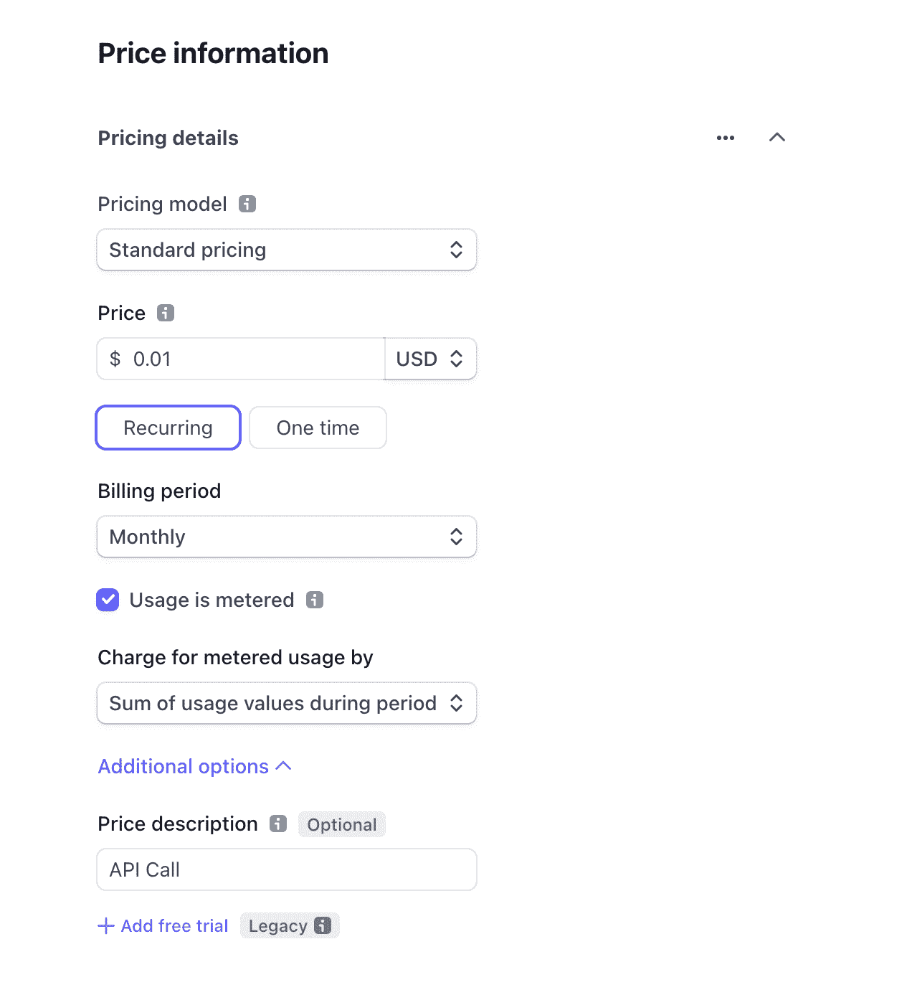

#### 包裹

如果您按包或一组单位对 API 使用收费，请使用此选项。例如，您可以将其设置为每 1000 次 API 调用收取 10 美元。每当用户超过 1000 个 API 调用阈值时，他们就要再支付 10 美元。


#### 分等级的

使用分级定价层，这可能会导致订单中的某些产品价格不同。例如，您可能对前 100 个单位收取$10.00，然后对接下来的 50 个单位收取$5.00。如今，这仅适用于经常性价格。


#### 卷

如果您根据售出的总数量对每个单位收取相同的价格，请使用。例如，50 个单位的费用为每单位 10 美元，100 个单位的费用为每单位 7 美元。

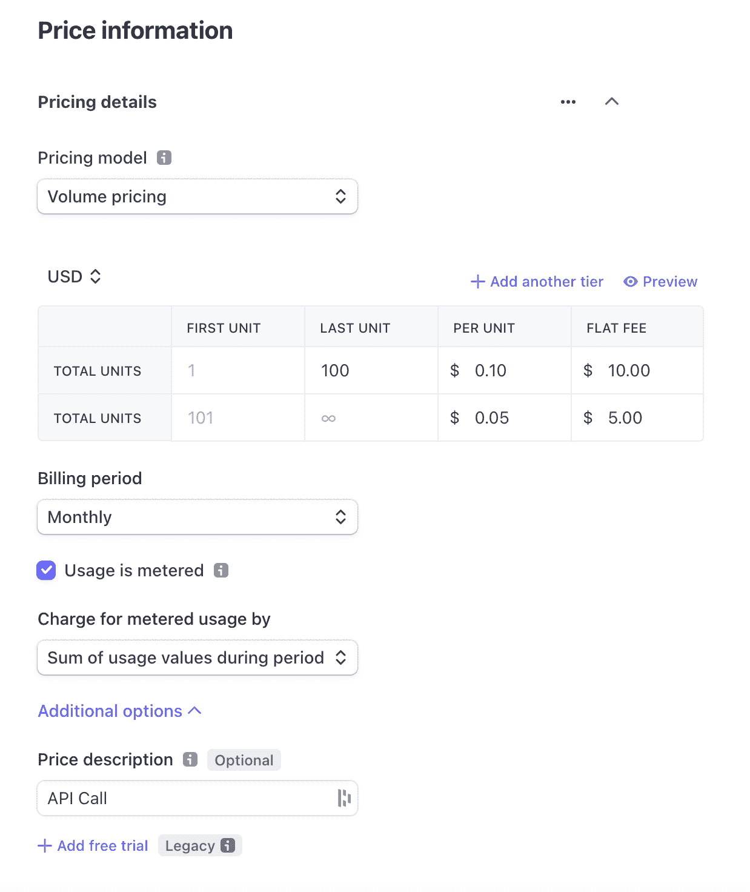

### **价格**

根据所选的定价模型，可以在此字段中设置价格。

### **计费周期**

计费周期可以设置为:

*   每天地；天天地
*   一周的
*   每月
*   每 3 个月
*   每 6 个月
*   每年的
*   习俗

对于您的 Moesif 配置，我们建议将计费周期设置为每月。我们还建议，如果您正在使用 Moesif 的计费计量功能，也要检查**使用量是否被计量**框。

### **按计量使用收费**

一旦选择了**计量使用量**复选框，将出现计量使用量的**收费选项。此字段允许您选择计量使用的计算和收费方式。该字段的可用值为:**

#### 期间使用值的总和

在整个计费周期中，用户都要为其记录的使用付费

#### 期间内最近的使用值

根据计费周期结束前记录的最后一次使用情况向用户收费

#### 最近使用值

在每个计费周期结束时，用户需要为在整个订阅周期中记录的最后一次使用付费

#### 期间的最大使用价值

用户按计费周期内记录的最高金额付费

Moesif 计费仪表的最佳设置是将该值设置为时段期间的**使用值总和，因为 Moesif 每小时向条带报告使用情况**

### **价格描述**

这是一个可选的*但推荐的*字段。您可以在这里简单描述您的价格。这将使您更容易理解您在 Moesif 的计费表中选择的价格，尤其是在一种产品有多个价格的情况下。

输入产品和价格的所有详细信息后，您可以点击屏幕右上角的**保存产品**。


当您创建产品时，您将能够在**产品**屏幕上查看和编辑它们。

## 2 -启用 Moesif-条带集成

一旦你的产品和价格确定下来，是时候开始整合 Stripe 和 Moesif 了。要开始在 Moesif 中配置 Stripe，请转到**计费表**页面，并点击屏幕右上角的**编辑计费提供商**下拉菜单。


这将打开条带配置屏幕，引导您完成集成。在这个屏幕上，您可以获得将 Stripe 插入 Moesif 所需的所有信息。配置的每个步骤都包含在模式中。

### 将 Moesif webhook 添加到条带

集成的第一步是将 Moesif webhook 添加到 Stripe 的配置中。添加此功能允许 Stripe 向 Moesif 发送订阅更新。

要将 Moesif webhook 添加到 Stripe，从右上角点击**开发者**，然后在左侧菜单中点击 **Webhooks** 。这将把你带到**网页挂钩**页面，在那里你可以查看现有的网页挂钩并添加新的。要添加新的 webhook，我们将单击屏幕底部的**添加端点**按钮。


从这里，我们将插入我们的 Moesif API 端点 URL，并配置要监听的事件。您需要将 Moesif Webhook URL 复制到**端点 URL** 字段，然后点击 **+选择事件**按钮。


> 这些细节都可以在前面提到的 Moesif 中的条带配置页面上找到。

您应该选择**客户**下的选项进行**选择所有客户事件**。之后，点击屏幕底部的**添加事件**按钮。


此后，您将返回到添加端点详细信息的原始屏幕。滚动到屏幕底部，单击**添加端点**将端点保存到条带。


### 将条带 API 细节插入 Moesif

为了让 Moesif 向 Stripe 中的订阅添加使用量，我们需要向 Moesif 中添加 Stripe API 细节。这是在 Moesif 的条带配置屏幕中完成的，与我们之前使用的屏幕相同。


目前，Moesif 仅支持条带 API 的版本 **2020-08-27** ，因此字段默认为**条带 API 版本**字段。

对于 **Stripe API 密钥**字段，您需要从 Stripe 中检索 API 密钥以将其插入。从**开发者**界面，与我们在上一步中使用的界面相同，您将点击 **API 键**。然后，您将能够在屏幕上的**秘密密钥**或生成的**受限密钥**字段中看到您的 API 的私有密钥。两个键都可以用。


从 Stripe 复制密钥后，您将把这个密钥粘贴到 Moesif 中的 **Stripe API 密钥**字段。完成后，回到 Moesif，你可以向下滚动到屏幕底部，点击**保存**保存配置。


至此，Moesif 中的条带集成已经完成，您可以开始使用它了。

> 或者，您也可以在 Moesif 中定制**客户 ID 源**。默认设置将适用于本指南，不需要进行任何更改。如果您确实需要定制它，这些设置允许您指定如何将条带**订阅**和**客户**对象映射到 Moesif 中的**公司 ID** 和**用户 ID** 。

## 3 -创建计费计数器

一旦您在 Moesif 中激活了条带集成，您就可以开始设置您的计费表了。在 Moesif 中创建的计费表做两件事:根据特定的标准跟踪使用情况，并向计费提供者报告使用情况。Moesif 允许您相对容易地设置非常简单和非常复杂的计费表。

要创建计费计数器，在 Moesif 中，您将导航至计费计数器屏幕。您可以从右侧菜单中完成此操作。


在计费表屏幕上，点击屏幕右上角的 **+添加计费表**。

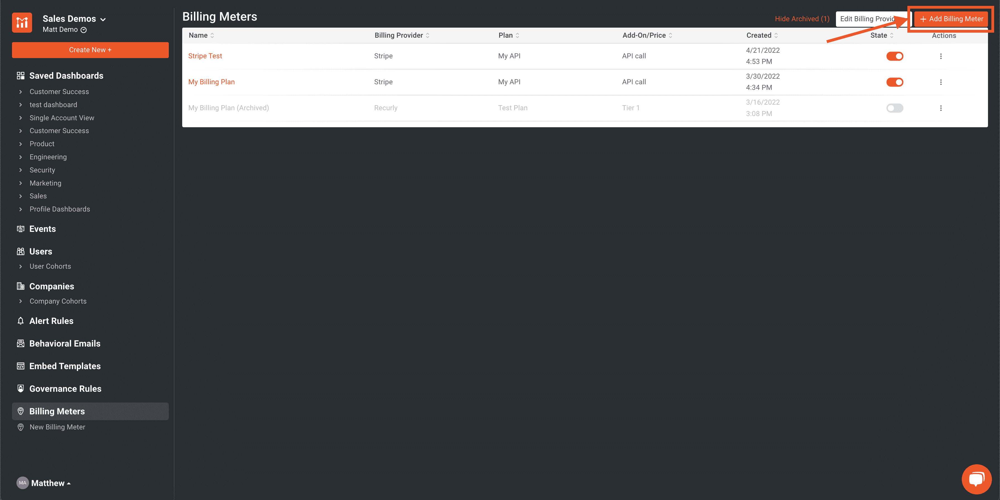

下一个屏幕是您可以实际输入计费表标准的地方。

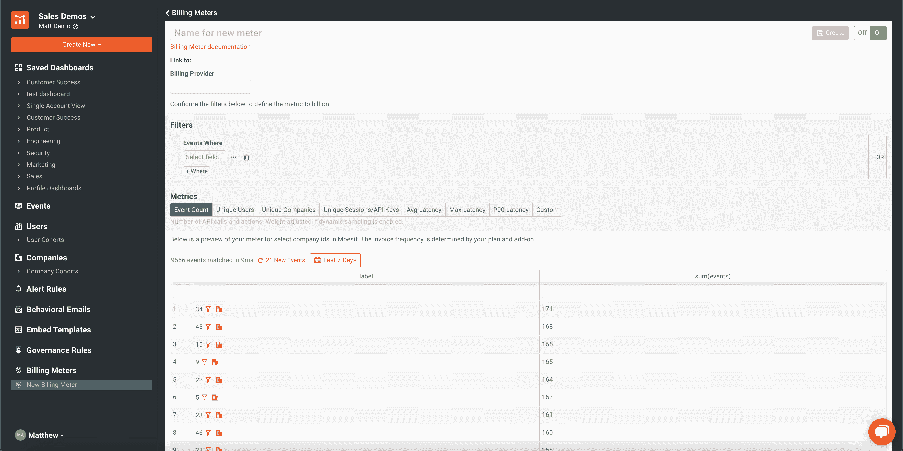

该屏幕上的字段包括:

#### **计费电表名称**

这是您的新计费仪表的 Moesif 内部名称

#### **账单提供商**

在此下拉列表中，您可以选择要将您的使用指标发送给哪个计费提供商。

#### **产品(仅条纹)**

在这里，您可以选择您在 Stripe 中设置的产品，您希望您的使用指标与该产品相关联。

#### **价格(仅条纹)**

计费计数器的计费提供者设置中的最后一个字段，您可以在这里选择要将您的使用指标绑定到哪个价格。

#### **过滤器**

在过滤器配置下，您将配置您的计费标准，以仅包括符合特定标准的请求。

#### **指标**

在这里，您可以选择希望计费的指标。可用选项包括:

#### **事件计数**

这将增加符合过滤标准中列出的标准的每个事件的使用量。

#### **唯一用户**

每当唯一用户发送符合过滤标准的请求时，这将增加使用量。对于每个唯一用户，无论该用户的事件计数是多少，计数都将增加 1。

#### **独特的公司**

每当一家独特的公司发送符合过滤标准的请求时，这将增加使用量。对于每个唯一的公司，无论该公司的事件计数如何，计数都将增加 1。

#### **唯一会话/API 密钥**

每当使用唯一的会话或 API 键来发送符合过滤标准的请求时，这将增加使用量。对于每个唯一的会话或 API 键，无论该特定会话或 API 键的事件计数如何，计数都将增加 1。

> 指标下还有其他选项，但以上 4 个选项最适用于基于使用的计费。

例如，在本指南中，我们将创建一个计费计量器，它将过滤单个端点*的流量，以及请求接收到成功的 HTTP 200 响应*的位置。我们将使用**事件计数**指标来确保每个请求都被添加到计数中并发送给计费提供者。

在 Moesif 中，计费表的配置如下所示。

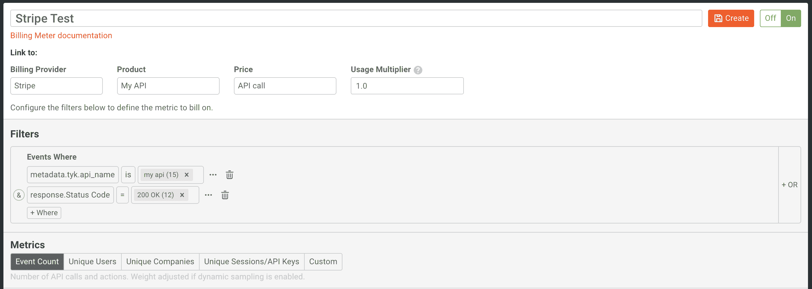

然后，我们将点击屏幕右上角的**创建**按钮。这将创建并激活计费计数器。然后，当您返回计费表仪表板时，您将看到新的计费表出现。


Moesif 现在将汇总使用情况，并将这些详细信息发送给 Stripe。现在计费表已经配置好了，我们将建立一个流程让用户注册、订阅并发布一个 API 密匙，这样他们就可以使用我们的货币化 API。

## 4 -创建**/注册**端点

我们将构建自己的流程，而不是使用预先构建的入职流程，例如通过 API 网关中的开发人员门户。我们将创建一个名为 **/register** 的端点，然后我们可以用它来装载想要使用 API 的用户。结果将是用户收到一个他们可以使用的 API 密钥，该密钥将跟踪他们的使用情况。

因为我们使用 Moesif、Stripe 和 Tyk 作为我们整体解决方案的一部分，所以我们需要确保每个组件都能正常工作。

端点将执行以下操作:

*   在条带中创建用户
*   为新用户订阅条带中的 API 订阅
*   在 Moesif 中创建 CompanyID(这将是条带订阅 ID)
*   在 Moesif 中创建 UserID(这将是 Stripe 客户 ID)
*   创建 API 密钥(使用条带客户 ID 作为令牌别名)

> 如果您在 Moesif 和其他系统中已经有了您想要使用的用户和公司标识符，而不是使用 Stripe 的客户和订阅作为您的 id，您可以在 Moesif 中的 Stripe 配置设置下这样做。

在本例中，我将使用 Express 创建一个简单的 NodeJS API 来完成上述任务。

### 创建国家预防机制项目

首先，我们将创建一个名为 **moesif-monetization** 的文件夹，我们将在其中添加 API 代码。然后我们将运行 **npm init** 来转变 **moesif 货币化**，这样我们就可以在我们的项目中使用 npm。为此，您将在 **moesif-monetization** 目录中运行以下命令。

`npm init`

> 创建 npm 项目时，您可以根据需要填写详细信息或使用默认值。

然后你应该会在你的**moesif-monetary**文件夹中看到一个 **package.json** 文件。

现在，在您喜欢的 IDE 或文本编辑器中打开这个目录。在本教程的剩余部分，我将使用 VS 代码进行所有的编码。

### 添加项目依赖项

我们现在将使用正确的依赖项编辑我们的 **package.json** 文件。在 **package.json** 中，我们将在**依赖关系**对象下添加以下条目。

```py
 "dependencies": {
   "@stripe/stripe-js": "^1.29.0",
   "body-parser": "^1.20.0",
   "dotenv": "^16.0.0",
   "express": "^4.17.1",
   "http": "0.0.1-security",
   "moesif-nodejs": "^3.1.14",
   "node-fetch": "^2.6.5",
   "path": "^0.12.7",
   "stripe": "^8.219.0"
 } 
```

保存文件，然后导航到终端并运行:

`npm install`

现在，您的依赖项将被引入到项目中，并添加到 **node_modules** 文件夹中。这些依赖项将帮助我们调用 REST 端点，连接到 Stripe 和 Moesif，以及我们将内置到应用程序中的各种其他功能。

### 创建。环境文件

我们不会将条带键和其他静态值硬编码到我们的应用程序中，而是将它们抽象到一个. env 文件中。我们可以使用添加到名为 **dotenv** 的 **package.json** 中的依赖项来实现这一点。

在根目录下，创建一个名为**的文件。env** 。在这个文件中，我们将添加几个条目，其中包含代码中使用的键和值。

```py
STRIPE_KEY="sk_test_XXX"
STRIPE_PRICE_KEY="price_XXX"
MOESIF_APPLICATION_ID="YOUR_MOESIF_APP_ID"
TYK_AUTH_KEY="TYK_AUTH_ID"
TYK_API_ID="TYK_API_ID"
TYK_API_NAME="API_NAME"
TYK_URL="http://TYK_URL:3000" 
```

这里的值可以在以下位置找到:

`STRIPE_KEY`

这可以在我们之前为计费表获取 Stripe 和 Moesif 集成密钥的相同位置找到。实际上，您可以为两者使用同一个键，或者创建一个**受限键**，仅包含每个函数所需的范围。

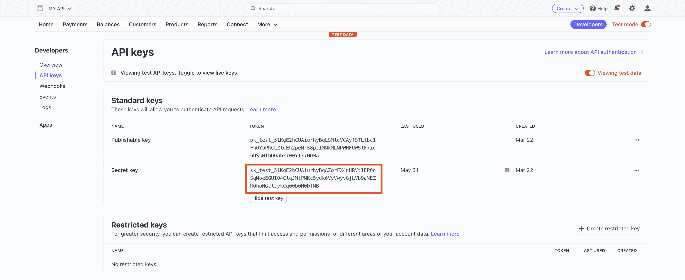

`STRIPE_PRICE_KEY`

这将是您之前在 Stripe 中创建的**价格**的价格键。这可以通过转到条带中的产品并从 **API ID** 列中获取值来找到。


`MOESIF_APPLICATION_ID`

这可以在 Moesif 中找到，方法是转到屏幕左下方的菜单链接(将显示您的姓名)并选择 **API 键**。


然后，密钥将出现在出现在**收集器应用 Id** 下的页面上。


`TYK_AUTH_KEY`

这个键是向 Tyk Dashboard API 发送请求所需的键。这可以在 Tyk 中通过导航到**用户**页面并点击一个用户的条目(可能是你自己的)来找到。


单击用户后，您将能够看到用户的 **Tyk Dashboard API 访问凭证**。这是您将插入到配置中的密钥。

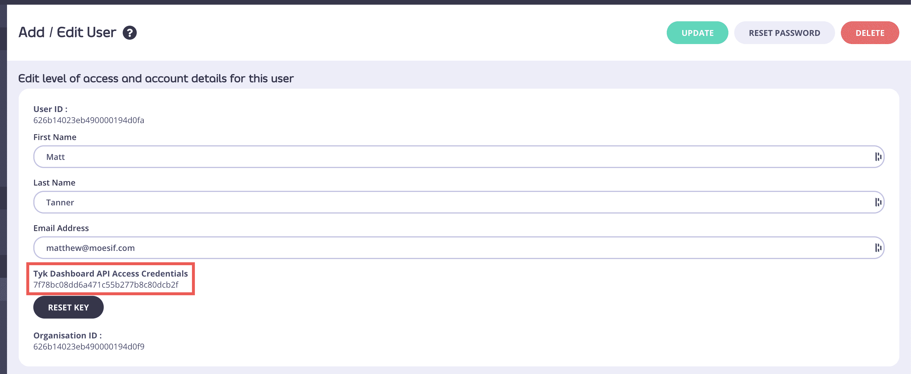

`TYK_API_ID`

可以通过转到**API**并复制端点的 **ID** 来找到端点的 API ID。

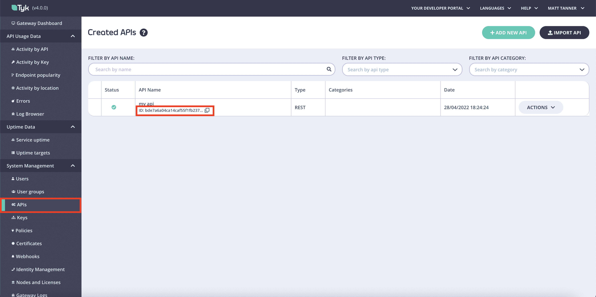

`TYK_API_NAME`

端点的 **API 名称**可以在与 **API ID** 相同的地方找到。

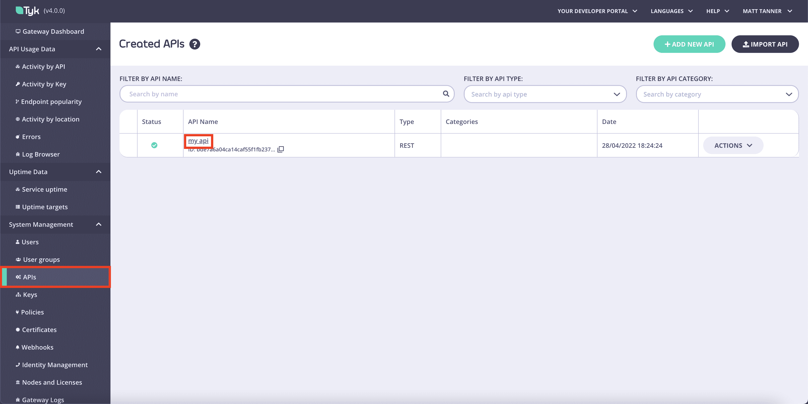

`TYK_URL`

这将是 Tyk 仪表板 API 的 URL。通常，这将在端口 3000 上托管，但如果您有自定义配置，它可能会有所不同。

一旦用七个键值对填充了文件，保存文件。在本教程的剩余部分，我们不需要再接触这个文件。

### 创建 app.js 文件

在我们的应用程序的根目录中，我们将创建一个 **app.js** 文件(如果还没有创建的话)。在这个文件中，我们将添加以下代码，这些代码添加了我们的依赖项并创建了一个基础 REST 端点。

```py
require('dotenv').config();
const express = require('express');
const path = require("path");
const bodyParser = require('body-parser');
const moesif = require('moesif-nodejs');
const Stripe = require('stripe');
// npm i --save node-fetch@2.6.5
const fetch = require('node-fetch');

const app = express();

const port = 5000;
const stripe = Stripe(process.env.STRIPE_KEY);

var jsonParser = bodyParser.json();

const moesifMiddleware = moesif({
 applicationId: process.env.MOESIF_APPLICATION_ID
});

app.use(moesifMiddleware);

app.post('/register', jsonParser,
 async (req, res) => {
 }
)
app.listen(port, () => {
 console.log(`Example app listening at http://localhost:${port}`);
}) 
```

在上面的代码中，我们是:

*   导入一些依赖项
*   配置条带依赖关系
*   配置 Moesif 中间件
*   创建**/注册**端点
*   设置我们的应用程序在端口 5000 上运行，并启动我们的节点应用程序

> 你会注意到我们有 **process.env.STRIPE_KEY** 和**process . env . moes if _ APPLICATION _ ID**。这些值将来自**。我们在最后一步中创建的 env** 文件。

### 实现/register 终结点

我们的下一步是实现 **/register** 端点。这个端点将在 Tyk、Stripe 和 Moesif 之间创建我们的绑定。结果将是 Tyk 生成的 API 密钥，该密钥将使用情况与 Moesif 中的用户相关联，然后将报告给 Stripe。

我们流程中的第一步是创建 Stripe 中的客户。我们将使用我们的 Stripe JS 依赖来做到这一点。我们将使用请求正文中的参数(电子邮件、名字、姓氏)通过使用 **stripe.customers.create** 函数在 Stripe 中创建客户。然后，我们将把创建的客户存储在一个自定义变量中，这样我们就可以访问 Stripe 中生成的**客户 ID** 。

```py
const customer = await stripe.customers.create({
     email: req.body.email,
     name: `${req.body.firstname}  ${req.body.lastname}`,
     description: 'Customer created through /register endpoint',
   }); 
```

接下来，我们将为这个新用户订阅我们之前在 Stripe 中创建的 API 订阅。我们将使用**stripe . subscriptions . create**函数，并使用从之前的函数调用中生成的**客户 ID** 来订阅它们。这将返回一个**订阅**对象，其中包含一个我们稍后会用到的 ID。

```py
 const subscription = await stripe.subscriptions.create({
     customer: customer.id,
     items: [
       { price: process.env.STRIPE_PRICE_KEY },
     ],
   }); 
```

一旦在 Stripe 中创建了用户和订阅，我们现在将使用 Moesif 中间件来创建用户，并将他们的相关详细信息添加到 Moesif 中。首先，我们将调用 Moesif 中间件的 **updateCompany** 函数，将条带 **subscription.id** 映射到 Moesif 中的 **companyId** 。

```py
 var company = { companyId: subscription.id };
   moesifMiddleware.updateCompany(company); 
```

然后，我们将对 **updateUser** 函数执行类似的步骤，并使用它将条带 **customer.id** 映射到 **userId** ，将条带 **subscription.id** 映射到 **companyId** ，并将我们收集的关于用户的一些其他元数据映射到 Moesif。

```py
 var user = {
     userId: customer.id,
     companyId: subscription.id,
     metadata: {
       email: req.body.email,
       firstName: req.body.firstname,
       lastName: req.body.lastname,
     }
   };
   moesifMiddleware.updateUser(user); 
```

在这一点上，我们现在已经将所有的用户详细信息插入到必要的平台中。我们的下一步是为这个用户生成一个 API 密钥。为此，我们将使用 **/api/keys** 端点调用 Tyk Dashboard API。这将在响应中为用户返回一个 API 密钥。我们通过 **data.key_id** 访问那个 API 密匙。

```py
var body = {
     alias: customer.id,
     last_check: 0,
     allowance: 1000,
     rate: 1000,
     per: 60,
     expires: 0,
     quota_max: 10000,
     quota_renews: 1424543479,
     quota_remaining: 10000,
     quota_renewal_rate: 2520000,
     access_rights: {
       [process.env.TYK_API_ID]: {
         api_id: process.env.TYK_API_ID,
         api_name: process.env.TYK_API_NAME,
         versions: [
           "Default"
         ]
       }
     }
   }
   var response = await fetch(`${process.env.TYK_URL}/api/keys`, {
     method: 'post',
     body: JSON.stringify(body),
     headers: {
       'Content-Type': 'application/json',
       "Authorization": process.env.TYK_AUTH_KEY
     }
   });
   console.log(response);
   var data = await response.json();
   console.log("Tyk create API key");
   console.log(data);
   var tykAPIKey = data.key_id; 
```

> 您将在请求体中看到，我们正在创建一个相当大的 JSON 对象。几个重要的字段是:

*   **别名** -这将是我们的 Stripe 客户 ID，它将映射到 Moesif 中的用户 ID
*   **访问权限**
    *   **api_id** -这将从**中提取 **API ID** 。env** 文件
    *   **API _ Name**——这将从**中拉出 **API 名称**。env** 文件。

其余的字段可以根据需要进行定制。

可选地，我们也将用户的 API 键添加到 Moesif 中的元数据中。出于测试的目的，如果您丢失了密钥，并且不想回到 Tyk 中检索它，这使得获取密钥变得很容易。我们将在 Moesif 中间件中再次使用 **updateUser** 函数来完成这项工作，在元数据对象中提供生成的 API 键。

```py
 var user = {
     userId: customer.id,
     metadata: {
       apikey: tykAPIKey,
     }
   };
   moesifMiddleware.updateUser(user); 
```

最后，我们将向调用者返回一个 **200 OK** 响应，在响应体中包含 API 键。

```py
 res.status(200)
   res.send({ apikey: tykAPIKey }); 
```

完整的端到端功能如下所示:

```py
app.post('/register', jsonParser,
 async (req, res) => {
   // create Stripe customer
   const customer = await stripe.customers.create({
     email: req.body.email,
     name: `${req.body.firstname}  ${req.body.lastname}`,
     description: 'Customer created through /register endpoint',
   });

   // create Stripe subscription
   const subscription = await stripe.subscriptions.create({
     customer: customer.id,
     items: [
       { price: process.env.STRIPE_PRICE_KEY },
     ],
   });

   // create user and company in Moesif
   var company = { companyId: subscription.id };
   moesifMiddleware.updateCompany(company);

   var user = {
     userId: customer.id,
     companyId: subscription.id,
     metadata: {
       email: req.body.email,
       firstName: req.body.firstname,
       lastName: req.body.lastname,
     }
   };
   moesifMiddleware.updateUser(user);

   // send back a new API key for use
   var body = {
     alias: customer.id,
     last_check: 0,
     allowance: 1000,
     rate: 1000,
     per: 60,
     expires: 0,
     quota_max: 10000,
     quota_renews: 1424543479,
     quota_remaining: 10000,
     quota_renewal_rate: 2520000,
     access_rights: {
       [process.env.TYK_API_ID]: {
         api_id: process.env.TYK_API_ID,
         api_name: process.env.TYK_API_NAME,
         versions: [
           "Default"
         ]
       }
     }
   }
   var response = await fetch(`${process.env.TYK_URL}/api/keys`, {
     method: 'post',
     body: JSON.stringify(body),
     headers: {
       'Content-Type': 'application/json',
       "Authorization": process.env.TYK_AUTH_KEY
     }
   });
   var data = await response.json();
   var tykAPIKey = data.key_id;

   var user = {
     userId: customer.id,
     metadata: {
       apikey: tykAPIKey,
     }
   };
   moesifMiddleware.updateUser(user);

   res.status(200)
   res.send({ apikey: tykAPIKey });
 }
) 
```

有了这些，我们现在可以实际测试我们的端点，以确保每一部分都按预期工作。结果应该是拥有 API 密钥的注册用户将记录和报告使用数据到 Stripe。让我们继续测试它。

## 5 -向**/寄存器**端点发送测试请求

一旦您的 **/register** 端点被编码和部署，就该测试它了。现在我们将简单地使用 Postman 来发送请求。我们的请求将包含一个 JSON 请求体，它将包含:

*   西方人名的第一个字
*   姓
*   电子邮件

当然，这是我们在 Tyk、Stripe 和 Moesif 中正确配置系统和配置文件所需的最少信息。您可以根据特定用例的需要轻松添加更多字段。

在 Postman 中，我们将使用以下信息创建我们的请求:

*   请求类型:发布
*   端点 URL:http://localhost:5000/register
*   请求正文:

    ```py
    {  "firstname":  "Userfirstname",  "lastname":  "Userlastname",  "email":  "test@test.com"  } 
    ```

一旦所有东西都插入到 Postman 中，它应该看起来像下面这样:


一旦发送了请求，响应应该包含新注册用户可以使用的 API 键。


我们现在将检查 Tyk 和 Stripe，以确保我们注册的信息正确输入到每个目标系统中。我们首先要检查的是条纹。

重新登录 Stripe，您将导航至**客户**屏幕。您应该会在列表中看到新创建的用户。


单击列表中新添加的客户。在下一个屏幕上，您应该看到该客户也订阅了您的 API 订阅。


一旦在 Stripe 中确认了这两个条目，您就可以转到 Tyk，以确保在那里也正确地设置了用户。

使用 Tyk 仪表板，导航至**键**屏幕。这里您应该看到一个键的条目，其中的**别名**等于用户的条带客户 ID。

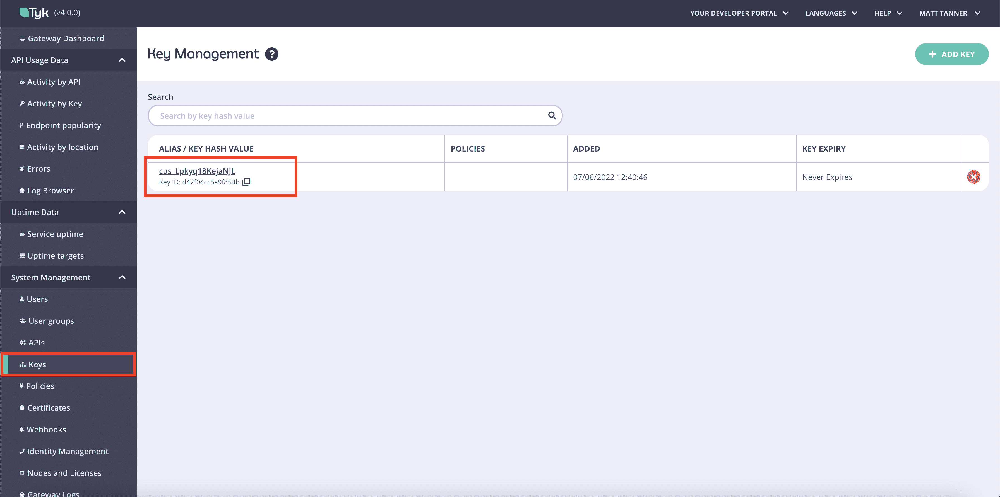

完成这些检查后，我们可以放心地假设我们的 **/register** 端点正在正确地设置我们的用户在 Tyk 和 Stripe 中的帐户和订阅。

## 6 -使用生成的 API 密钥调用您的 API

我们的下一步是实际使用我们生成的 API 密钥。然后，我们将确认所有正确的信息都已添加到 Moesif 中。我们正在确认的数据包括:

*   条带客户 ID 映射到 Moesif 用户 ID
*   条带订阅 ID 映射到 Moesif 公司 ID
*   Moesif 包含用户配置文件中的条带元数据

### 使用邮递员发送请求

接下来，让我们使用 Postman 或另一个平台向 **/my_api** 端点发送请求。这是我们在上面的**步骤 3** 中为其设置计费计量的端点。

在《邮差》中，我们将:

*   将 **/my_api** API 端点作为请求 URL
*   选择**授权**标签
*   选择**类型**作为 **API 键**
*   填充 API 键详细信息
*   将**键**设置为“授权”
*   将**值**设置为生成的 API 密钥
*   将**添加到**字段值设置为“标题”

下面是 Postman 中填充请求配置的一个示例。


要将请求发送到我们的端点，请单击 **Send** 。

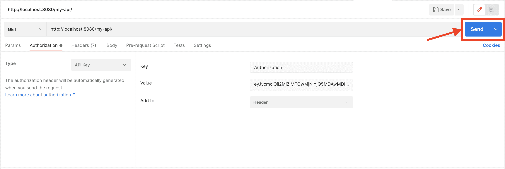

一旦发送，您的请求应该通过 Tyk 代理，API 调用分析应该在 Moesif 着陆。

### 确认 Moesif 收到了请求信息

回到 Moesif，您将导航到 **Events** 屏幕，在这里您将看到您刚刚发送的请求。您应该会看到该条目包含一个用户 ID 和一个公司 ID，其中填充了 Stripe 用户和订阅 ID。条目应该如下所示:


> 客户 ID 看起来像“库斯 _XXXX ”,订阅 ID 看起来像“sub_XXXX”。

如果您点击显示在**现场活动日志**屏幕条目中的**用户 ID** ，您将进入用户资料页面。在此页面上，我们将确认条带元数据是否存在。我们需要在配置文件中添加一个新列来显示条带数据。为此，在个人资料页面，点击 **…更多操作**按钮，然后点击**自定义个人资料的布局**。


然后，我们将为条带元数据添加一个新列。您将单击屏幕最右侧的+按钮来创建一个新列，我们将在其中添加条带元数据。


> 根据您的分辨率和屏幕大小，您可能需要向右滚动才能看到 **+** 按钮。

然后，您将深入到**元数据>条带>客户>创建**，并在新行中使用该字段。我还改变了一个更适合的列图像。您可以通过点击图片并选择最合适的图片进行定制。


您还可以添加其他字段，但是目前仅这一个字段就足以告诉我们 Moesif 正在正确地从 Stripe 接收数据。

> 如果您没有看到条带元数据条目作为可用字段，请等待几分钟。如果几分钟后条带元数据不存在，请确保 Moesif 中的条带配置是正确的。在确认或编辑它之后，尝试创建一个新用户并再次发送请求以确认集成正在工作。

现在，我们已经确认了通过 Tyk 代理的 API 调用正在工作，并且在 Moesif 中标记了正确的用户和公司详细信息。我们还确认了 Stripe 正在将数据发送回 Moesif，这些数据被正确地映射到相应的用户配置文件，这是通过 Moesif 中的 Stripe 元数据确认的。

## 7 -创建前端

接下来，我们想添加一个简单的小前端，这样我们就不需要通过 Postman 调用我们的 API 键了。我们将制作一个快速的注册表单，然后返回一个 API 密钥供新注册的用户使用。

### 将您的前端文件添加到应用程序

在应用程序的根目录中，我们将添加两个文件。我们将添加一个**index.html**和一个**索引. js** 。


### 添加您的路由以提供静态 html 文件

在 **app.js** 文件中，我们将添加一个路由来服务静态 HTML 文件。在我们的 **/register** 端点代码下面，我们将添加另一个端点。添加以下代码:

```py
app.get("/", function (_req, res) {
 res.sendFile(path.join(__dirname, "index.html"));
 res.sendFile(path.join(__dirname, "index.js"));
}); 
```

现在，当您导航到 [http://localhost:5000/](http://localhost:5000) 时，这段代码将加载网站(一旦我们插入了代码)。

### 编写前端表单和逻辑

最后，让我们添加前端 HTML 和 JavaScript 功能的代码。在**index.html**文件中，我们将添加如下所示的标记:

```py
<!DOCTYPE html>
<html lang="en">
 <head>
   <meta charset="utf-8" />
   <meta name="viewport" content="width=device-width, initial-scale=1" />
   <meta name="theme-color" content="#000000" />
   <meta
     name="description"
     content="Moesif Embedded Dashboard example"
   />
   <title>None React App Example</title>
 </head>
 <body>
   <noscript>You need to enable JavaScript to run this app.</noscript>
   <h1>
     Moesif Monetization Example
   </h1>
   <div id="form-input">
     email: <input id="email-input" placeholder="email" />
     first name: <input id="firstname-input" placeholder="first name" />
     last name: <input id="lastname-input" placeholder="last name" />
     <button onClick="submitRegistration()">Register</button>
   </div>
   <div id="apikey-output"></div>
   <p id="error-message"></p>
   <script src="index.js"></script>
 </body>
</html> 
```

这个标记将显示一个表单，允许用户输入电子邮件、名字和姓氏。它还有一个 **Register** 按钮，该按钮将为 **submitRegistration()** 调用 JavaScript 函数。该函数将在我们的 **index.js** JavaScript 文件中。

**index.js** 文件将如下所示:

```py
async function submitRegistration() {
   const email = document.getElementById("email-input").value;
   const firstname = document.getElementById("firstname-input").value;
   const lastname = document.getElementById("lastname-input").value;
   const errorElement = document.getElementById("error-message");
   const apikey = document.getElementById("apikey-output");

   var body = { email, firstname, lastname };
   var response = await fetch('http://localhost:5000/register', {
     method: 'post',
     body: JSON.stringify(body),
     headers: {'Content-Type': 'application/json'}
   });
   var data = await response.json();
   apikey.innerHTML = data.apikey;
 } 
```

该函数将从表单中获取输入，将其发送到我们的 **/register** 端点，并在屏幕上显示返回的 API 键。

## 8 -测试前端

要测试前端，保存您的代码更改并重启服务器。然后，在浏览器中，导航到  。然后，您将看到表单出现。


### 填写表单字段并提交

现在表单已经加载到屏幕上，填写字段并点击**注册**按钮。这将获取信息，将其发送到我们的**/注册**端点，并给我们生成的 API 密钥。

> 建议您使用不同的电子邮件，而不是之前直接通过 **/register** 端点创建 API 密钥时使用的电子邮件。

### 确认 API 密钥已返回

单击 submit 按钮后，几秒钟后，API 键应该会返回到 UI。


## 9 -向您的货币化 API 发送请求

我们将再次希望确保所有东西都与我们的 UI 一起工作，直到我们的后端系统。为此，只需重复步骤 6 中的步骤，确认用户和公司 id 已正确填充，并且为该用户和新的 API 密钥返回了条带元数据。

## 10 -确认所有部件工作正常

尽管这是可选的，但这一步可能有助于解决我们之前步骤中可能出现的任何问题。这里有几件事需要检查，以确保一切正常。通过 UI 创建新用户并使用生成的 API 键调用 API 后，请确认以下内容:

*   成条纹状
    *   确认已经使用您在 UI 中输入的详细信息在 Stripe 中创建了一个客户
    *   确认客户订购了正确的产品和价格
*   在 Tyk
    *   API 密钥是在 Tyk 中创建的
    *   密钥**别名**字段匹配来自条带(以 **cus_XXXX** 开始)的客户 ID
*   在默西迪斯
    *   您的 API 调用被记录在 Moesif 的实时事件日志中
    *   您的 API 调用在 Moesif 的用户和公司字段中分别有 Stripe 客户 ID 和订阅 ID。
    *   确认在 Moesif 中填充了条带元数据

## 11 -检查条带的使用情况

最后，几个小时后，最好进入 Stripe，确认使用情况是否被添加到用户订阅中。确保您已经发送了几个请求，以确保您有一些应该发送到条带的数据。

> 从 Moesif 到条带化可能需要几个小时。如果几个小时后 Moesif 中仍然没有数据，请确保您遵循了本指南中概述的所有步骤。这包括确保来自 Moesif 的用户和公司 ID 正确地映射到 Stripe 中相应的密钥。

要检查使用情况，在 Stripe 中，您需要导航到**客户**屏幕，并选择与您进行 API 调用的客户。一旦选中，您应该会看到您通过 **/register** 端点注册的用户的一些活动订阅。我们之前创建的那个叫做**我的 API** 。单击订阅条目。


在下一个屏幕上，点击价格条目旁边的**查看用法**。


现在应该会弹出一个模型，向您显示已经从 Moesif 中剥离的 API 的用法。


> 请记住，Moesif 向 Stripe 报告时会有延迟。如果您的数据还没有，请稍后再回来查看。

## 包扎

货币化一直是一个难以逾越的障碍。许多定制解决方案提供了灵活性，但工程和支持成本非常高。有了 Moesif，API 货币化就有可能在极短的时间内实现。正如本文所展示的，通过一点点配置和最少的代码，我们可以在最短的时间内创建一个生产就绪的后付费货币化方案。