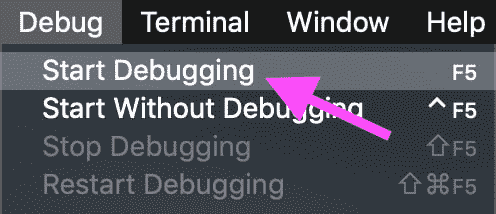
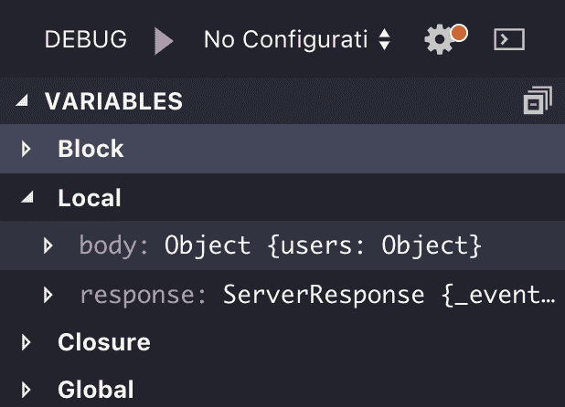
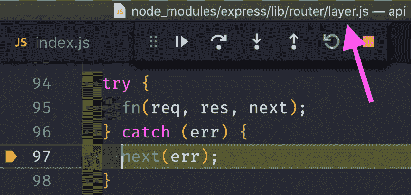
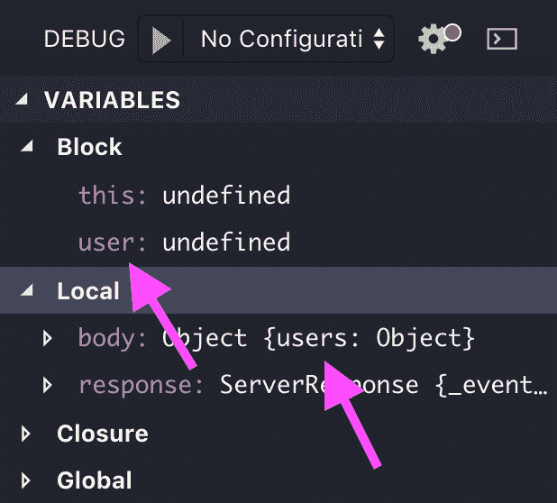

# 在 VS 代码调试器中调试节点 js Express API

> 原文:[https://www . moes if . com/blog/technical/Debugging/Debugging-a-Node-JS-Express-API-in-VS-Code-Debugger/](https://www.moesif.com/blog/technical/debugging/Debugging-a-Node-JS-Express-API-in-VS-Code-Debugger/)

## 为什么

当我们创建软件时，我们很少做到没有错误。API 创建也不例外，所以迟早我们需要调试它。在 JavaScript 中，调试任务的第一站通常是*登录到控制台*，但是使用调试器可以给我们更完整的体验。

Node js 是一个跨平台和开源的 JavaScript 运行时环境，允许 JavaScript 在服务器端运行。

有许多指南可以找到最佳的节点 js bootcamp，但在本教程中，我们将学习如何在 Visual Studio 代码(简称 VS 代码)的帮助下调试基于 [Express 的 API](/blog/api-guide/development/api-resources-for-nodejs-developers/) 。

## 什么

[Express](https://expressjs.com/) 是一个*【Nodejs 的极简 web 框架】*。它允许我们**将函数直接链接到 API 端点**，这是一种快速简单的构建 API 的方法。

[Visual Studio Code](https://code.visualstudio.com/) 是一个*“流线型代码编辑器，支持开发操作，如**调试**，任务运行和版本控制。”*

我们还将使用 [cURL](https://curl.haxx.se/) 向我们的 API 发送请求。

## 怎么

我们将使用 Express framework 创建一个简单的 API，然后尝试借助 VS Code 的调试功能而不是控制台来调试它。然后，您可以轻松地添加 API 端点并进行 API 调用。

### API 设置

首先，我们创建一个新的 Node js 项目并安装我们的依赖项。

```py
$ mkdir api
$ cd api
$ npm init
$ npm i express body-parser 
```

接下来，我们创建一个`index.js`文件，它将作为我们的主服务器脚本。

```py
const express = require("express");
const bodyParser = require("body-parser");

const users = [{ id: 0, name: "admin" }];

const server = express();
server.use(bodyParser.json());

server.get("/users", (_, response) => response.send({ users }));
server.get("/users/:id", ({ params: { id } }, response) => {
  const user = users[id];
  response.send({ user });
});
server.post("/users", ({ body }, response) => {
  const { user } = body;
  user.id = users.length;
  users.push(user);
  response.send({ user });
});

server.listen(9999, () =>
  console.log("API running on http://localhost:9999")
); 
```

我们使用`users`数组作为内存中的数据存储。它由管理员用户初始化。

接下来，我们创建我们的 Express `server`并使用`bodyParser`包的 JSON 中间件；它允许我们访问存储在`POST` HTTP 请求体中的 JSON 字符串的值。

然后，我们创建三个 API 端点。两个`GET`端点，因此我们可以请求一个所有用户和一个特定用户的 ID 列表，以及一个`POST`端点来创建一个新用户。

让我们用下面的命令启动 API！

```py
$ node .
API running on http://localhost:9999 
```

### 使用 API

既然我们的 API 已经启动并运行，我们可以尝试用 cURL 查询它。为此，我们需要打开一个新的终端窗口并执行以下命令。

创建用户:

```py
$ curl -H "Content-Type:application/json" -d '{"user":{"name": "kay"}}' localhost:9999/users
{"user":{"id":1,"name":"kay"}} 
```

列出所有用户:

```py
$ curl localhost:9999/users
{"users":[{"id":0,"name":"admin"},{"id":1,"name":"kay"}]} 
```

列出一个用户:

```py
$ curl localhost:9999/users/1
{"user":{"id":1,"name":"kay"}} 
```

创建另一个用户:

```py
$ curl -H "Content-Type:application/json" -d '{"users":{"name": "xing"}}' localhost:9999/users
<!DOCTYPE html>
<html lang="en">
<head>
<meta charset="utf-8">
<title>Error</title>
... 
```

*哦不！*我们的 JSON 里有个错别字，`users`而不是`user`。由于我们没有在我们的`POST /users`端点中处理这个问题，Express 只是用一个 HTML 格式的错误来响应。

这是一个简单的问题示例，可以很容易地修复，但是让我们用它来启动 VS Code 的调试器，这样我们就可以在运行时直接调查出了什么问题。

### 使用 VS 代码的调试器

用 VS 代码调试节点 js APIs 非常容易。

我们检查想要调试哪个端点，并在端点触发的函数中设置一个断点。这是通过左击行号来完成的。让我们在第 15 行的*上找到它，这应该是我们的`POST /users`端点函数的第一行。*


然后我们通过点击顶部菜单的*调试- >开始调试*或者按下 *F5* 来启动调试器。



VS 代码将为我们启动应用程序和调试器。它还将通过 Node.js 的调试协议将两者联系在一起。

然后我们重新发送导致 cURL 错误的请求，并尝试找出发生了什么。

```py
$ curl -H "Content-Type:application/json" -d '{"users":{"name": "xing"}}' localhost:9999/users 
```

该请求将运行链接到`POST /users`的函数，并在其第一行的断点处暂停。

如果我们查看代码左侧的侧栏，我们可以看到一个*变量*类别，以及各种子类别，如*块*和*局部*。我们打开*本地*看看里面有什么。



正如我们所看到的，我们有两个局部变量，`body`是类型`Object`和`response`是类型`ServerResponse`。

让我们用 *F10* 进入下一行，看看会发生什么。

一切似乎都像预期的那样工作。

让我们再看下一行。

**轰！**

不知何故，我们最终在代码库的一个完全不同的地方？



似乎我们通过设置我们的`user`对象的`id`创建了一个错误，这是怎么发生的？

让我们再次打开我们的`index.js`，将断点移动到*第 16 行*，并通过按 *F5* 让调试器运行到事件循环的末尾。

然后用 cURL 重新发送请求，看看在我们试图设置`user.id`之前发生了什么。

当我们查看*变量/块*类别中的侧栏时，我们可以看到我们的`user`对象实际上是`undefined`！如果我们打开*变量/局部*类别，也能看出原因。



我们的`body`有一个`users`属性，但是我们试图在*第 15 行*中从它那里析构一个`user`变量，这导致我们试图在*第 16 行*中写`user.id`时出错。

现在我们知道了问题所在，让我们停止调试器并修复它。

```py
server.post("/users", ({ body }, response) => {
  const { user } = body;

  if (!(user instanceof Object))
    return response.send({ error: '"user" object missing in JSON!' });

  user.id = users.length;
  users.push(user);
  response.send({ user });
}); 
```

让我们重新启动服务器，让它运行新代码:

```py
$ node .
API running on http://localhost:9999 
```

并重新发送我们有问题的请求:

```py
$ curl -H "Content-Type:application/json" -d '{"users":{"name": "xing"}}' localhost:9999/users
{"error":"\"user\" object missing in JSON!"} 
```

最后，我们得到一个有用的 JSON 格式的错误消息。

## 结论

借助 VS Code 的集成调试器调试基于节点 js 的 API 是一项简单的任务。我们只需要设置一个断点，不需要额外的代码。

它为我们提供了许多现成的运行时洞察力，包括:

*   当前变量的值
*   观察单个变量的能力
*   当前调用堆栈
*   当前加载的脚本