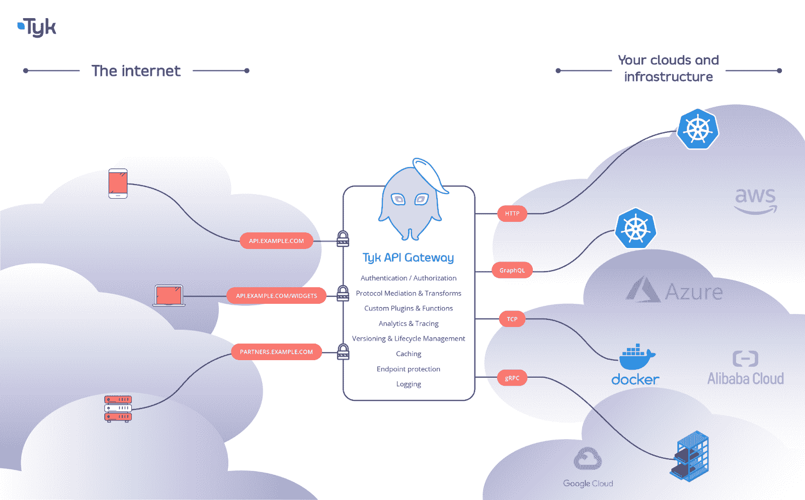
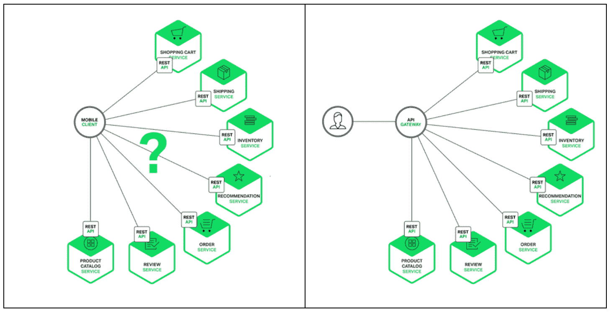
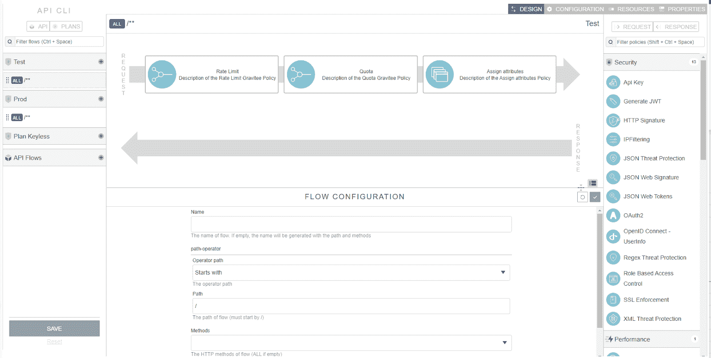
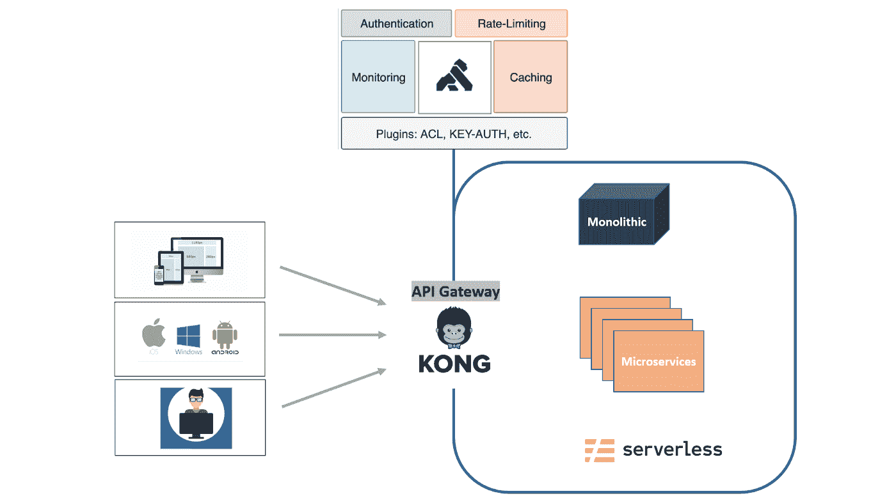

# 开源 API 网关综述

> 原文:[https://www . moes if . com/blog/API-engineering/API-gateways/Open-Source-API-Gateway-round up/](https://www.moesif.com/blog/api-engineering/api-gateways/Open-Source-API-Gateway-Roundup/)

API 优先的公司依靠广泛的服务套件来构建他们的 API，并为他们的客户创造价值。多个团队可能使用不同的技术开发 API。通过流程和工具，您希望这些 API 与您的 API 消费者(无论是内部的还是外部的)保持一致。公司用来将多个 API 结合在一起的一个工具是 API 网关。

API 网关是一种简化访问、认证和管理公司众多 API 端点的工具。通常，网关不知道您的架构、数据格式和其他 API 决策。例如，一个成熟的 API 程序可能有不同的 API 类型。类似地，网关可以处理内部和外部服务，这意味着您可以使用一个网关来处理微服务、移动后端，甚至是合作伙伴或公共 API。

在本文中，我们将讨论 API 网关的常见特性。我们将详细介绍一些最通用、最受欢迎的开源 API，它们是如何工作的，以及如何利用它们来监控 API 的使用和性能，从而为 API 消费者创造更多价值。

## API 网关的特性

API 网关在实现上有所不同，但都有一些共同的特性:

*   数据有效性
*   证明
*   版本控制
*   贮藏
*   分析学

如果一个 API 不返回它所声称的，开发者将很难或者不可能使用它。数据验证将确保您的用户向您的端点发送正确的数据类型，您的服务器正确地存储它们，并且您的 API 向您的用户返回正确的数据类型。

您还可以通过 API 网关实现身份验证。例如，您可能需要对 API 中的特定端点和特性进行速率限制或限定，以供经过身份验证的用户使用。API 网关有助于保持跨终端的身份验证的一致性，即使您实现了多个后端服务。

大多数 API 网关还处理每个端点的版本控制，因此您的组织和用户都可以跟踪您的 API 发生了什么变化。这为您的 API 用户带来了很好的开发体验，并且当您知道开发人员正在使用哪个版本时，可以提供更好的客户支持。

网关也可以实现缓存来提高 API 的性能。根据请求的复杂程度，有些调用可能不需要与数据源进行完整的往返。在这些情况下，您可以配置网关来提供缓存和其他节省资源的过程，以保持 API 的性能和响应性。

最后，可以配置网关来收集 API 分析。这使得它成为关于 API 及其使用的数据的单一来源。使用持续监控来收集端点的使用日志，然后分析数据或与强大的分析工具集成，以便您的组织能够获得对您的 API 的重要洞察。

这些 API 网关特性将帮助您构建可靠地随用户伸缩的 API。虽然您会找到许多解决方案，但我们还是收集了一些开源 API 网关供您考虑。这些工具不仅提供了所需的特性，还提供了在社区贡献的帮助下随时间扩展的能力。此外，您的工程团队可以构建满足您需求的功能，并将其回馈给社区。

在接下来的几节中，我们将分解一些流行的开源 API 网关，以便您可以获得一些关于它们如何工作的信息。

## Tyk

Tyk 是一个模块化的开源 API 网关。它是灵活和开源的，因此您可以集成第三方中间件或部署定制插件，使您的 Tyk 实现适应您公司的需求。Tyk 允许您连接系统中的每一个数据源、API 端点和后端服务，使您能够轻松地查看您的 API、控制访问、记录您的 API 以及监控您的 API 路由。您可以将 Tyk 实现为一个自托管解决方案，由您的组织负责管理用于运行 Tyk 的服务器，或者您可以将其用作一个完全托管的解决方案，如果这对您的组织更好的话。

Tyk 开发团队通过与用户交流和构建插件来满足他们的需求，在社区中发挥着积极的作用。通过使核心 Tyk 平台模块化，默认的 Tyk 体验可以保持轻量级和敏捷，同时为具有不常见用例的用户维护一个易于访问和易于实现的插件库。这使得 Tyk 成为可能改变或扩大范围的 API 的最佳选择，因为随着时间的推移，Tyk 也可以变得更适合您的 API。

## NGINX

虽然 NGINX 主要被认为是一个流行的 web 服务器、反向代理和负载平衡器，但 NGINX 也可以充当 API 网关。如果 NGINX 已经是您的 API 技术栈的一部分，您的团队可以快速地将它部署为 API 网关，这是一个很好的选择。它也非常适合单一服务整体和微服务后端实现。

NGINX 受益于他们为在互联网上提供和开发服务而构建的大型 NetOps 和 DevOps 工具套件。对 NGINX 进行故障排除非常简单，因为它有一个庞大的现有用户群，这些用户共享关于在生产中使用 NGINX API 网关的实用信息。NGINX 被大公司和小公司使用，它适合许多常见的用例，并且很容易上手。

## Gravitee

Gravitee 是一个流行的开源 API 网关，它通过一个独特的实现与我们列表中的其他部分共享一组核心特性。它允许您控制谁访问您的 API 以及如何访问，限制他们可以在您的 API 上使用哪些资源，并添加功能来监控您的 API。它旨在为具有 HTTP 服务器经验的开发人员快速实现。Gravitee 被构建得尽可能的轻量级和灵活，因此您的开发人员在构建它的时候会有最小的开销，这样您就可以为您的用户创造价值。

Gravitee 在这个列表中是独一无二的，因为它的所有服务都是开源的，而不仅仅是 API 网关。这包括增强核心 Gravitee API 网关的托管服务。这为他们提供了独特的社区参与度和透明度。用户可以公开报告 Gravitee 的问题，并跟踪他们的问题是如何解决的，或者通过软件更改，或者记录用户自己可以做些什么来解决常见问题。

## 孔（姓）

Kong 基于 NGINX，一个已经出现在我们名单上的 API 网关。Kong 的某些独特之处使其成为各种规模的组织的普遍选择。Kong 专注于实现大规模的微服务 API 架构，并提供了一套大型插件来实现这一目标。不需要安装每一个 Kong 服务就可以上手。它是模块化和灵活的，因此您只需安装您的团队想要使用的服务。

Kong 的插件开发工具包(PDK)也允许你使用 Go 或 Lua(一种基于 C 的脚本语言)构建插件来扩展 Kong 的功能。这导致了大量由 Kong、他们的合作伙伴以及他们的庞大社区构建的插件可供选择。如果核心的 Kong API gateway 不能满足您组织的所有需求，您可以利用现有的插件库，或者专门为您的独特用例构建一个全新的插件。如果您正在寻找一个社区驱动的、开源的 API 网关，Kong 可能是您的正确选择。

## 扩展您的 API 网关

我们列出的 API 网关超越了 API 网关最常见的核心特性，具有独特的方面，可能使它们更适合您的组织。在评估 API 网关时，考虑您的长期需求是很重要的，这样您就不会在产品开发周期的后期被迫迁移到不同的解决方案。我们讨论的所有 API 网关都有方法来轻松扩展它们的功能。随着时间的推移，您的 API 需求会发生变化，您将需要能够更改您的 API 网关以满足您的需求，从而继续为您的用户提供最佳体验。

API 可观察性是一个重要而强大的特性，可以添加到 API 网关中。您可以向 API 网关添加强大的分析和监控功能，以获取产品指标，并构建一个为客户创造价值并推动增长的 API。Moesif 为最流行的 API 网关提供了优秀的本地插件，并且可以很好地适应许多 API 管理栈。Tyk 和 [NGINX](https://www.moesif.com/blog/technical/nginx/How-to-Monitor-Nginx-Api-Logs-With-Moesif/?utm_campaign=Int-site&utm_source=blog&utm_medium=body&utm_term=open-source-api-gateway-roundup) 有很好的与 Moesif 集成的例子，你可以快速实现或适应另一个 API 网关。

乍一看，为您的组织选择 API 网关似乎是一个挑战。只要您选择的 API 网关具有我们讨论过的核心特性，并且可以扩展到包括像使用 Moesif 的 [API 监控这样的强大特性，您就可以随着 API 产品的增长而不断改进您的 API 网关。](https://www.moesif.com/enterprise/api-analytics-for-api-management/?utm_campaign=Int-site&utm_source=blog&utm_medium=body&utm_term=open-source-api-gateway-roundup)