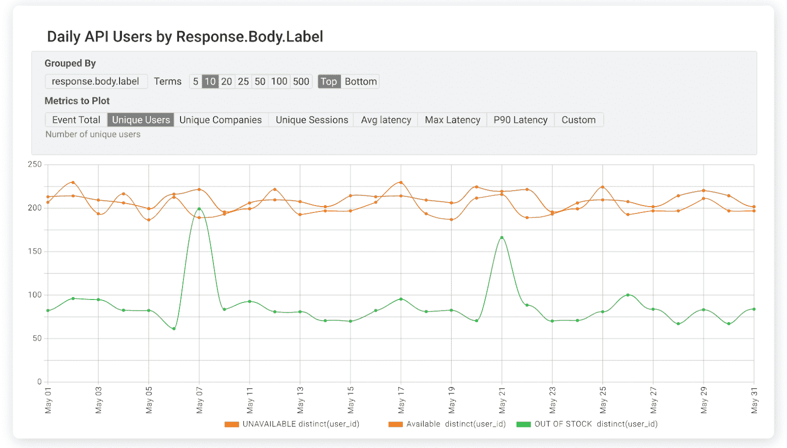
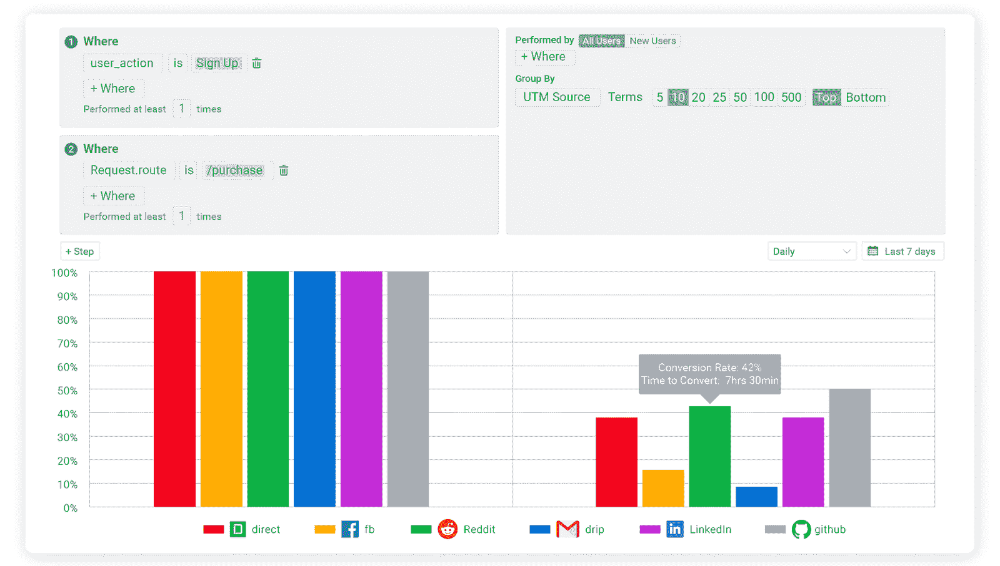
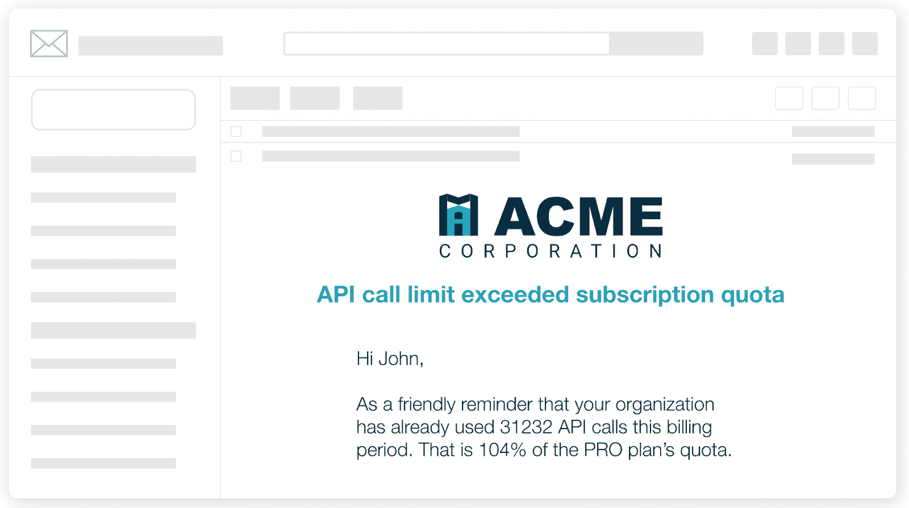

# Moesif 和 Datadog:特点相似性、差异以及它们如何协同工作

> 原文:[https://www . moes if . com/blog/technical/API-analytics/moes if-and-data dog-Feature-similarity-Differences-and-How-They-Can-Work-Together/](https://www.moesif.com/blog/technical/api-analytics/Moesif-and-Datadog-Feature-Similarities-Differences-and-How-They-Can-Work-Together/)

Moesif 和 Datadog 都是提供监控和查看指标能力的平台。然而，从本质上讲，这两个平台为您的组织和使用它们的团队做了非常不同的事情。两者可以很好地互补，并包含有助于制造无缝扩展的更好产品的功能。

[Datadog](https://www.datadoghq.com/?utm_campaign=Int-site&utm_source=blog&utm_medium=body-cta&utm_term=dd-moesif-stack2) 非常适合确保基础设施按预期运行，向您发出错误警报，并监控停机时间和性能下降。这都是良好的应用程序性能监控解决方案的一部分。从本质上讲，如果您拥有对您的运营至关重要的基础设施和资源，Datadog 是查看您的运营状况全貌的绝佳方式。该平台可以帮助确保您的技术操作的所有部分都顺利运行，并在不顺利时提醒您。

另一方面，Moesif 更关心从用户和公司的角度进行监控和分析。Moesif 可以确保用户再次使用你的产品，提供关于他们如何使用它的有价值的见解，授权使用它的团队推动采用，等等。Moesif 让你看到端到端的用户旅程，包括用户如何与你的应用或 API 产品交互，以及他们如何使用它。通过启用公司跟踪，您还可以查看特定公司的一组用户是如何与您的产品进行交互的。

两者都有不同的目的和目标，但它们一起可以创建一个端到端的业务图，包括您的用户和操作。建立一个伟大的企业包括拥有伟大的产品体验和坚实的基础设施监控，以确保最佳性能。

## 高基数、高维度分析

像 Datadog 这样的工具擅长单维分析，这意味着有一个度量名称和一个随时间变化的值。可能有少量的标签或维度，但通常为数不多。对于产品驱动的团队来说，重要的是不仅要理解交易量，还要理解客户通过 API 发送的不同类型的负载和查询。这可以跨数千个不同的查询参数、HTTP 头和主体键来定义。此外，这些字段中的每一个都可以有大量不同的值(高基数)，包括客户标识符本身。

这就是 Moesif 的优势所在，它使产品所有者能够通过无数种不同的可能性来分割他们的 API 使用数据。例如，在下图中，我们可以在响应有效负载“标签”中跟踪每天经历**缺货**与**可用**的独立用户数量。虽然 DevOps 工程师对独立用户和他们是否看到缺货不太感兴趣，但这些见解对于做出良好的业务决策至关重要。

由于两个平台针对不同的目标使用不同的指标和数据，因此一起使用它们是有意义的。将两者结合使用有很多好处，有助于生成整个业务的整体视图。涵盖一切，从客户如何使用您的产品，一直到产品运行的基础设施如何运行。

现在，让我们看看每个平台都包含哪些功能。

## 分解特征

这两个平台都提供了多种功能，可以从多个方面帮助您的企业。下面是对每个平台提供的内容、其重要性以及如何补充其他平台的分析。

### 连接器、插件和集成

这两个平台都支持市场上许多最常见的平台，具有各种集成。由于这两个平台在一个组织中服务于不同的功能，它们的连接器、插件和集成反映了这一点。

Datadog 更支持基础设施，因此有许多连接器，如帮助监控安全性、容器、编排、成本管理和问题跟踪的连接器(仅举几例)。AWS、Google Cloud Platform 和 Azure 上许多最流行的工具和平台都得到了支持，这里仅举几例。

Moesif 支持大多数 API 框架。其中包括 Node.js、Python、Java 等的[服务器集成](https://www.moesif.com/implementation?utm_campaign=Int-site&utm_source=blog&utm_medium=body-cta&utm_term=dd-moesif-stack2)。Moesif 还为流行的 API 网关和 API 管理工具提供插件，包括 Kong、NGINX、Tyk、Envoy 等等。

Moesif 的连接器更侧重于产品用例。一些包括 Slack、Segment、Pendo、HubSpot、Salesforce、Marketo 等。

> ***TL；灾难恢复-两个平台都有许多可用的集成。Datadog 涵盖了大多数平台，在这些平台上，基础设施监控将是有益的。Moesif 集成了构建和管理 API 的最流行的方法，包括直接插入代码的服务器集成 SDK 或与 API 网关集成的插件。*T3】**

### 仪表盘

仪表板是汇集数据进行快速浏览的好方法。展示单一领域的关键见解是两个平台都擅长的事情。

Datadog 允许您构建[自定义仪表盘](https://www.datadoghq.com/product/platform/dashboards/?utm_campaign=Int-site&utm_source=blog&utm_medium=body-cta&utm_term=dd-moesif-stack2)来显示基本指标。运营团队可以非常轻松地查看每个系统的运行情况，包括性能、使用情况和其他表明平稳运行的关键值。

[Moesif 仪表板](https://www.moesif.com/features/api-dashboards?utm_campaign=Int-site&utm_source=blog&utm_medium=body-cta&utm_term=dd-moesif-stack2)可用于为所有可能关注的部门提取关键的客户洞察。例如，营销仪表板可以显示流量来源、网站参与度和客户保持率。产品仪表板可以显示客户激活漏斗、平均 TTFHW(首次 Hello World 的时间)以及显示客户如何使用 API 或平台的其他指标。

> ***TL；Datadog 中的 DR - Dashboards 可让您深入了解您的运营情况，并确保您的关键业务正常运行。这些都是可定制的，易于设置和优化。Moesif 还提供易于使用和设置的仪表板，包括一些开箱即用的仪表板。Moesif 仪表板可以显示许多团队，包括营销和销售，粒度指标，以帮助绩效和采用。*T3】**

### 发信号

在监控工具中，关键事件发生时向特定通道发送警报的能力至关重要。当满足特定条件时，警报允许用户在其选择的平台上得到通知。这意味着用户不必手动观察事件，而是可以“设置并忘记”，知道他们将自动和实时收到警报。

[Datadog 警报](https://docs.datadoghq.com/monitors/?utm_campaign=Int-site&utm_source=blog&utm_medium=body-cta&utm_term=dd-moesif-stack2)可以围绕您的基础设施内的条件。Datadog 能够创建主动检查指标、集成可用性、网络端点等的监视器。当警报被激活时，Datadog 可以通过电子邮件、吉拉、PagerDuty、Slack 或 WebHooks 发送警报。

当用户遇到某些情况时，Moesif 可以[创建警报](https://www.moesif.com/docs/api-monitoring/?utm_campaign=Int-site&utm_source=blog&utm_medium=body-cta&utm_term=dd-moesif-stack2)。这些可能是新用户注册、进行一系列 API 调用、API 流量异常增加或减少，或者用户遇到大量错误或集成问题。这些警报中的许多可以帮助您的团队积极主动，确保良好的用户体验，并快速缩小产品中的问题范围。

> ***TL；DR - Datadog 非常适合提醒您基础设施问题和一般技术操作，确保系统正常运行。Moesif 非常擅长警告特定的用户行为，并主动让开发人员、产品经理和支持团队意识到用户陷入困境或收到错误。*T3】**

### 用户和公司跟踪

用户行为分析的一个关键特性是能够分析不同用户所做的事件序列，而不仅仅是孤立地看待事件。为了能够分析复杂的用户行为，Moesif 中的 API 调用和动作可以[绑定到用户 id 或公司 id](https://www.moesif.com/docs/user-analytics/?utm_campaign=Int-site&utm_source=blog&utm_medium=body-cta&utm_term=dd-moesif-stack2) 。从那里，您可以跨多个 API 调用创建报告。例如，使用 Moesif，您可以找到对 GET /widgets/category/:id 进行了至少 10 次 API 调用，但对/purchases 进行了 0 次 API 调用的用户。

借助用户行为分析，以产品为导向的团队可以分析他们的[激活漏斗](https://www.moesif.com/docs/user-analytics/conversion-funnel-analysis/?utm_campaign=Int-site&utm_source=blog&utm_medium=body-cta&utm_term=dd-moesif-stack2)，并执行[群组保持分析](https://www.moesif.com/docs/user-analytics/cohort-retention-analysis/?utm_campaign=Int-site&utm_source=blog&utm_medium=body-cta&utm_term=dd-moesif-stack2)，以了解他们业务的健康状况。

这些类型的分析对于以产品为主导的组织来说是一个巨大的优势，因为在这些组织中，用户体验是最重要的考虑因素。

漏斗可以让你看到你的产品漏斗中不同步骤之间的转换率，比如注册用户中最终进行第一次 API 调用的用户的百分比。在此基础上，你可以根据用户统计数据(如营销活动)进行细分，以了解在哪里投入更多资源。留存分析可以让你看到用户是否忠诚，是否继续从平台中获取价值。细分让你可以深入了解谁是你的用户和公司，以及他们属于哪个细分市场。

因为 Moesif 可以通过 API 或像 [Segment](https://segment.com/?utm_campaign=Int-site&utm_source=blog&utm_medium=body-cta&utm_term=dd-moesif-stack2) 这样的连接器获取客户数据，所以您可以根据客户的人口统计数据来划分您的 API 使用和 API 指标。例如，为了更好地理解公司规模或职位的使用。这使得按计划或其他客户信息跟踪使用情况变得更加容易。

通过分析 API 有效负载和 UI 事件(通过 [Moesif 的 BrowserJS](https://www.moesif.com/docs/client-integration/browser-js/?utm_campaign=Int-site&utm_source=blog&utm_medium=blog-cta&utm_term=dd-moesif-stack2) 包或片段)，可以很容易地收集和操作战略性业务洞察。一个例子是优化应用程序中的电子商务交易。通过跟踪未完成的结帐，您可以确定不成功结帐的确切路线，与卖方一起解决问题，并主动通知买方该问题。这些信息也可以在产品团队中使用，以改善结账流程，从而避免将来的交易出现以前没有结账或结账不完整的问题。

Moesif 跟踪每个用户及其公司的能力使得“行为度量”的使用成为可能。这些类型的指标允许我们查看多个事件，而不是允许我们将多个事件联系起来以确定特定的行为模式。这正是 Moesif 能够做上述所有事情的原因。

有了 Datadog，你也可以看到用户正在做的动作，但是没有 Moesif 那么精细。然而，Datadog 支持一些非常基本的用户跟踪，这有助于调试平台上出现的基础设施和安全问题。但是 Datadog 不支持每家公司跟踪。由于 Datadog 应用于其分析模型的模型，因此不支持“行为指标”。

> ***TL；DR - Datadog 支持跟踪用户动作和调用，但更适合显示整体流量、API 调用和性能。Datadog 的用户跟踪功能更符合网络分析。Moesif 允许跟踪用户和公司的使用情况。这一功能使 Moesif 用户能够查看转换漏斗、保留分析和探索用户细分。Moesif 的功能旨在从用户第一次访问您的应用程序到他们最近的转换，增强用户的能力并改进您的产品。*T3】**

### 行为邮件

通常，用户在我们的产品中表现出的某些行为或采取的行动可以被跟踪。能够[自动发送定制和模板化的电子邮件](https://www.moesif.com/features/user-behavioral-emails?utm_campaign=Int-site&utm_source=blog&utm_medium=body-cta&utm_term=dd-moesif-stack2)是通知用户接下来的步骤或他们可能违反的某些条件(如速率限制)的好方法。

借助 Moesif 跟踪个人用户的能力，我们可以监控特定的条件或行为，并根据它们发送电子邮件。Moesif 可以在用户在入职或开始时遇到困难、接近 API 速率限制或任何其他用户可能受益于电子邮件的标准时检测并发送电子邮件，以引导他们回到正确的道路上。

因为 Datadog 更关心的是[基础设施和整体性能监控](https://www.datadoghq.com/product/infrastructure-monitoring/?utm_campaign=Int-site&utm_source=blog&utm_medium=body-cta&utm_term=dd-moesif-stack2)，所以它不支持这个功能。这是 Moesif 可以增强您已有的监控并帮助改善您的产品和用户体验的另一个案例。

> ***TL；DR - Behavioral 电子邮件可用于根据用户显示的行为或采取的行动，在他们的入职和用户旅程中提醒和帮助用户。Datadog 本身不支持行为电子邮件，因为它在指标方面不是以用户为中心的。Moesif 允许根据用户何时符合特定标准来发送定制的电子邮件。*T3】**

### 治理规则

[治理规则](https://www.moesif.com/docs/api-governance-rules/?utm_campaign=Int-site&utm_source=blog&utm_medium=body-cta&utm_term=dd-moesif-stack2)是 Moesif 更加关注基于用户的分析的另一个因素。这些要求包括阻止未经授权的访问或阻止过期发票用户的访问，这只是几个例子。

此功能不仅仅是监控和警报，而且像行为电子邮件一样，允许您自动根据指标采取实际行动。在 Moesif 中，您可以创建[阻塞和非阻塞规则](https://www.moesif.com/docs/api-governance-rules/creating-governance-rules/?utm_campaign=Int-site&utm_source=blog&utm_medium=body-cta&utm_term=dd-moesif-stack2#blocking-vs-non-blocking)。阻止规则可以阻止对 API 的访问，同时通知用户为什么会发生服务中断。非阻塞规则仍然允许请求继续到您的上游服务。Moesif 将只覆盖任何 HTTP 响应头，但不覆盖正文和状态代码。

Moesif 提供这一功能，作为创建和[实施治理规则](https://www.moesif.com/docs/api-governance-rules/creating-governance-rules/?utm_campaign=Int-site&utm_source=body-cta&utm_medium=dd-moesif-stack2)的一种简单方式。由于确定和执行这些规则所需的所有指标都已经存在于平台中，这使得它成为创建它们的绝佳场所。

Datadog 不支持这种方式的治理。Datadog 可以用来探索对组织的治理需求可能很重要的数据，但它不能像 Moesif 那样强制执行规则并通知用户。

> ***TL；Moesif 可以创建和实施灾难恢复治理规则，例如阻止未授权或可能的恶意访问。这些规则可以是阻塞的(停止请求)或非阻塞的(仍然允许请求通过)。Datadog 不能用于这样的功能，但是仍然可以被治理团队用作高级调查的一部分。*T3】**

### 基础设施监控

无论服务和产品有多好，只有当它们所依赖的基础设施运行良好时，它们才能成功。基础架构监控是组织确保其运营正常运行的一种重要方式。您可以监控网络速度变慢、流量异常增加、服务器出现问题以及其他影响系统稳定性和用户体验的事件。

Datadog 最初的功能主要集中在这种类型的监控上。可以说，Datadog 是满足这些需求的最佳和最受欢迎的工具之一。各种基础设施和服务可以轻松连接到 Datadog 并进行监控。由于这是 Datadog 平台的核心用例，难怪世界上许多最大的公司都利用 Datadog 来忽略他们的运营(包括 Moesif！).

Datadog 提供了一些很棒的仪表板，让您可以监督您的整个操作。您的架构中的每个基础设施都可以使用该平台进行监控、查询和优化。

Moesif 不提供基础设施监控，但是 Moesif 中的许多指标——包括那些表示 API 性能问题的指标——也可以通过使用 Datadog 来快速调试。一个很好的例子就是当大量的问题和警报开始涌入 Moesif 时。我们可以检测到用户遇到的问题，然后转向 Datadog，将其缩小到基础设施问题，或者可能是一些问题，如一些坏代码的发布问题。

> ***TL；DR - Datadog 是基础设施监控的最佳平台之一。几乎所有的系统都可以连接到 Datadog，因为它们提供了大量的集成。查看端到端操作和基础设施状态是 Datadog 真正擅长的地方。Moesif 不提供任何类型的基础设施监控，但是当与 Datadog 一起使用时，可以很容易地帮助诊断和解决影响用户的问题。*T3】**

## 包扎

Moesif 中的指标可以帮助塑造更好的用户体验，并帮助发现应用程序中的困难。这可能涵盖从前端体验(使用 Moesif 的 BrowserJS 或 Segment)到后端事件(比如与 API 的成功集成)的所有内容。Moesif 还可以通过将指标与生成自动电子邮件、通知甚至治理规则的工作流联系起来，帮助实现以产品为主导的组织。

Datadog 中的指标非常适用于跟踪运营和系统健康状况、整体流量、监控基础设施成本，以及确保您的应用以最高水平运行的[多个方面。](https://www.datadoghq.com/product/?utm_campaign=Int-site&utm_source=blog&utm_medium=body-cta&utm_term=dd-moesif-stack2)

如您所见，两个平台都为不同的受众和角色提供了许多有价值的见解。Moesif 专注于帮助您构建更好的产品，而 Datadog 则专注于确保您的基础设施和其他操作变量能够让这些产品发挥应有的性能。平台之间的功能重叠很少，因为它们在如何使您的业务扩展方面有两个非常不同的角色。将 Datadog 和 Moesif 结合使用是构建[完整而全面的分析和监控堆栈](blog1link)的最佳方式之一。