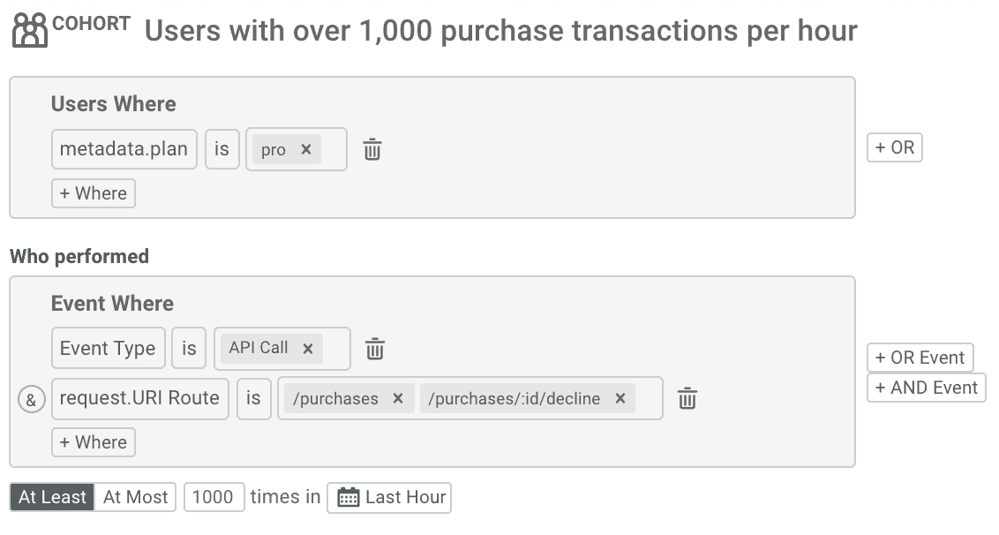
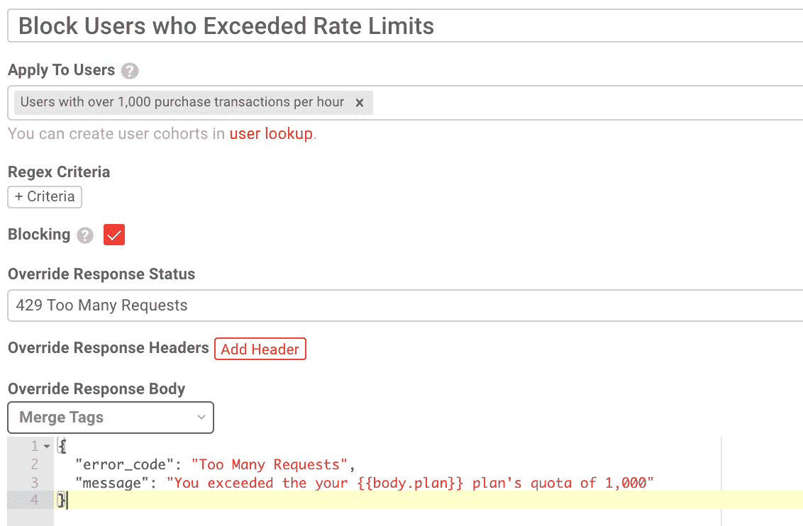
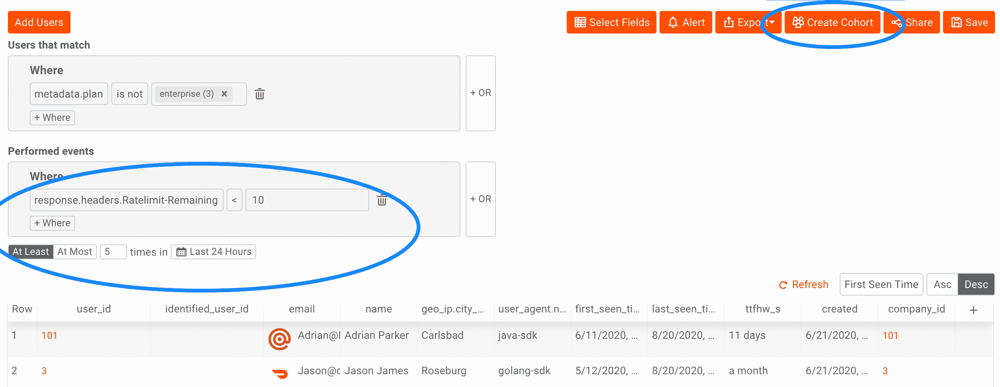
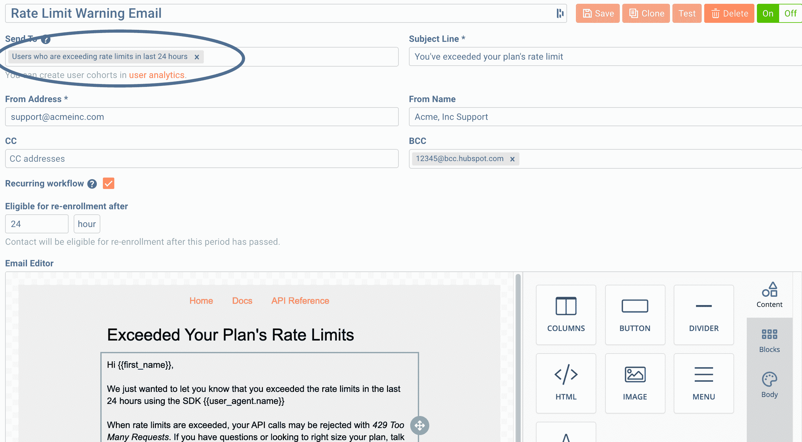

# moe SIF API 速率限制和配额的最佳实践，以避免愤怒的客户

> 原文:[https://www . moes if . com/blog/technical/Rate-limiting/Best-Practices-for-API-Rate-Limits-and-Quotas-With-moes if-to-Avoid-Angry-Customers/](https://www.moesif.com/blog/technical/rate-limiting/Best-Practices-for-API-Rate-Limits-and-Quotas-With-Moesif-to-Avoid-Angry-Customers/)

像任何在线服务一样，您的 API 用户期望高可用性和良好的性能。这也意味着一个客户不应该剥夺另一个客户访问您的 API 的权利。添加速率限制是一种防御措施，可以保护您的 API 不被请求淹没，并提高总体可用性。类似地，添加配额管理还可以确保客户遵守他们的合同条款和义务，从而确保您能够将 API 货币化。如果没有配额管理，客户可以很容易地使用远远超过其计划允许的资源，即使他们保持在您的整体服务器速率限制内。然而，不正确的实现可能会导致客户因为他们的请求没有按预期工作而生气。最坏的情况是，一个糟糕的速率限制实现可能会失败，导致所有请求被拒绝。本指南介绍了不同类型的速率限制和配额。然后，它介绍了设置速率限制的方法，既保护了您的 API，又不会让客户生气。

## 速率限制和配额是如何工作的

配额和速率限制都是通过跟踪每个 API 用户在定义的时间间隔内发出的请求数量来工作的，然后在用户超出限制时采取一些措施，这些措施可能是各种各样的事情，例如使用`429 Too Many Requests`状态代码拒绝请求、发送警告电子邮件、添加附加费等等。就像衡量不同的目标需要不同的指标一样，不同的速率限制用于实现不同的目标。

## 费率限制与配额管理

有两种不同类型的速率限制，每种都有不同的使用案例。短期速率限制侧重于保护服务器和基础设施不被淹没。然而，长期配额侧重于管理 API 资源的成本和货币化。

### 费率限制

短期速率限制关注每秒或每分钟的请求数量，帮助“平衡”峰值和突发流量模式，以提供后端保护。因为短期利率限额是实时计算的，通常很少有客户特定的背景。相反，可以使用每个 IP 地址或 API 密钥的简单计数器来测量这些速率限制。

#### 费率限制的使用案例示例:

*   保护下游服务不会因流量高峰而过载
*   提高可用性，防止某些 DDoS 攻击使您的 API 停机
*   提供时间缓冲来处理容量扩展操作
*   确保为客户提供一致的性能，并均衡数据库和其他相关服务的负载
*   由于下游计算和存储容量利用率不均衡，降低了成本。

#### 标识符

由于其时间敏感性，短期利率限额需要一种机制来识别不同的客户，而不严重依赖外部环境。一些速率限制机制将使用 IP 地址，但这可能是不准确的。例如，一些客户可能从许多不同的服务器调用您的 API。更健壮的解决方案可以使用 API 密钥或客户的 user_id。

#### 范围

短期速率限制的范围可以是服务器，也可以是使用 Redis 等缓存系统的分布式实例集群。您还可以使用请求中的信息，例如用于附加范围的 API 端点。这有助于根据不同服务的容量为它们提供不同的速率限制。例如，某些服务的维护成本可能非常高，并且很容易被淹没，例如启动批处理作业或在数据库上运行复杂的查询。鉴于其实时性，短期费率限制可能并不完美，这使其在计费和财务方面表现不佳，但在后端保护方面表现出色。

### 配额管理

与短期费率限制不同，长期配额衡量客户在更长时间内对 API 的利用率，例如每小时、每天或每月。配额并不是为了防止 API 出现高峰。相反，配额通过确保客户遵守他们同意的合同条款来管理 API 的资源。因为您可能有各种不同的 API 服务层，所以对于每个客户来说，配额通常是动态的，这使得它们比短期速率限制更难处理。除了配额义务，客户行为的历史趋势可以用于垃圾邮件检测，并自动阻止可能违反 API 服务条款的用户(ToS)。

#### 配额限制的使用案例示例:

*   阻止故意滥用，如发送垃圾邮件、刮擦或创建虚假评论
*   减少无意滥用，同时允许客户在需要时爆发使用
*   通过计量和基于使用的计费来适当地利用您的 API
*   确保客户不会消耗太多资源或增加您的云账单。
*   执行合同服务条款，防止“白吃白喝”

#### 标识符

长期配额几乎总是按租户或客户级别计算的。IP 地址在这些情况下不起作用，因为 IP 地址可能会改变，或者单个客户可能会从多个服务器调用您的 API，从而绕过实施。

#### 范围

因为配额通常强制执行合同的财务和法律条款，所以应该在所有服务器上统一，并且应该准确。在配额问题上，不能有任何“猜测”。

## 如何实现速率限制

通常像 NGINX 或 Kong 这样的网关服务器是集成速率限制的理想场所，因为大多数外部请求将通过网关层路由。对于短期速率限制违规，通用标准是用`429 Too Many Requests`拒绝请求。可以在响应头或主体中添加附加信息，指示客户端何时清除限制或何时可以重试请求。

对于长期配额违规，可以采取多种不同的措施。你可以拒绝类似于短期利率限制的请求，但你也可以处理其他方式，如增加超龄费。

### 阻止超过配额的用户

管理配额的一个简单方法是使用 [Moesif 的 API 治理特性](https://www.moesif.com/features/api-governance-rules)。这使您只需简单的 SDK 和用户界面中的几次点击，就可以添加管理 API 的规则。如何做到这一点的说明如下:

1.  在 Moesif 中，在*用户查找*选项卡下创建一个[用户群组](https://www.moesif.com/docs/user-analytics/saved-cohorts/)。当用户被认为超出其配额时，添加您的标准。在这个例子中，当用户在一个小时内做了超过 1000 个`/purchases`或`/purchases/:id/decline`时。

1.  现在我们已经创建了群组，转到*警报&治理*选项卡下的 *API 治理*。从这里，创建一个新的治理规则，如下所示。在这种情况下，我们用状态代码`429 Too Many Requests`短路请求。我们还会提供一条信息性消息，说明请求被拒绝的原因。

### 通知客户违反费率限制和配额

像任何故障或错误情况一样，您应该进行主动监控和警报，以了解客户何时接近或超过其限制/配额。您的客户成功团队应该主动接触遇到这些问题的客户，并帮助他们优化集成。因为手动扩展可能很慢且不可扩展，所以您应该准备一个系统，当客户的交易被拒绝而导致他们的应用程序出现问题时，该系统会自动通知他们遇到了费率限制。

让客户了解此类问题的一个简单方法是通过 [Moesif 的行为电子邮件功能](https://www.moesif.com/features/user-behavioral-emails)。如何做到这一点的说明如下:

1.  在 Moesif 中，在*用户查找*选项卡下创建一个[用户群组](https://www.moesif.com/docs/user-analytics/saved-cohorts/)。添加何时提醒客户的标准，例如查看 API 调用的数量，或者当速率限制标题达到某个阈值时。在本例中，我们添加了一个过滤器`response.headers.Ratelimit-Remaining < 10`

1.  现在我们已经创建了群组，请转到*警报&治理*选项卡下的*行为电子邮件*。从这里，创建一个新的电子邮件模板，并按照您的要求进行设计，如下所示。

### 剩余标头的速率限制

除了发送电子邮件，使用 HTTP 响应头通知客户任何剩余的速率限制也很有帮助。有一个[互联网草稿](https://tools.ietf.org/id/draft-polli-ratelimit-headers-00.html)指定了头`RateLimit-Limit`、`RateLimit-Remaining`和`RateLimit-Reset`。

通过添加这些头，开发人员可以很容易地设置他们的 HTTP 客户端，以便在正确的时间过后重试。否则，你可能会有不必要的流量，因为开发者不会确切地知道*何时*重试被拒绝的请求。这可能会造成糟糕的客户体验。

### 速率限制实施错误

甚至像速率限制这样的保护机制本身也可能有错误。例如，与 Redis 的不良网络连接可能导致读取速率限制计数器失败。在这种情况下，即使 Redis 集群不可访问，也不要人为地拒绝所有请求或锁定用户，这一点很重要。您的速率限制实现应该*失效开放*而不是*失效关闭*，这意味着所有请求都被允许，即使速率限制实现出错。

这也意味着速率限制不是容量规划不佳的解决办法，因为您仍然应该有足够的容量来处理这些请求，甚至设计您的系统来相应地扩展以处理大量涌入的新请求。这可以通过自动伸缩、超时和自动跳闸来实现，使您的 API 仍然能够工作。

## 结论

配额和速率限制是使您能够更好地管理和保护 API 资源的两个工具。然而，就业务用例而言，速率限制不同于配额。理解每种方法的差异和局限性是非常重要的。此外，提供工具也很重要，这样客户就可以随时了解速率限制问题以及审计 4xx 错误(包括 429)的方法。