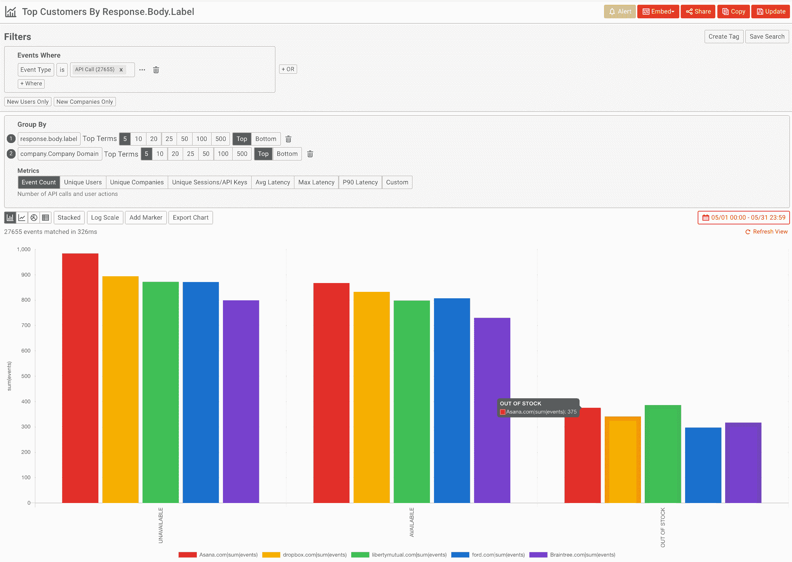
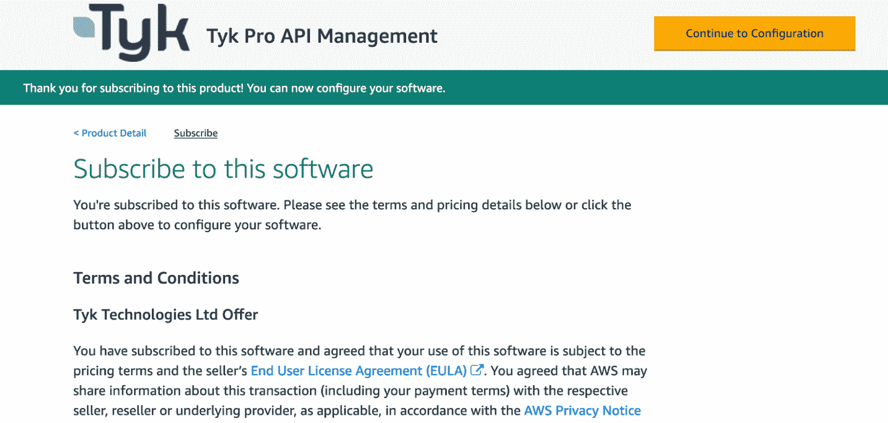
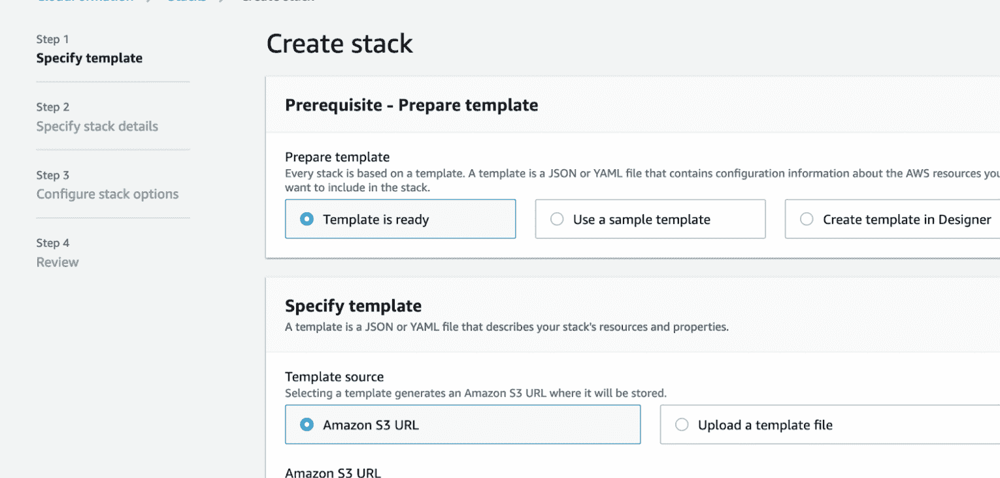
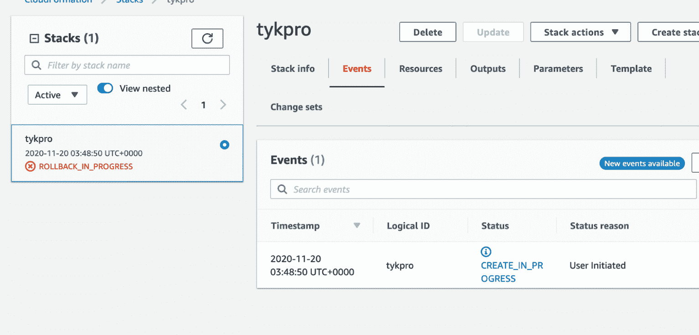
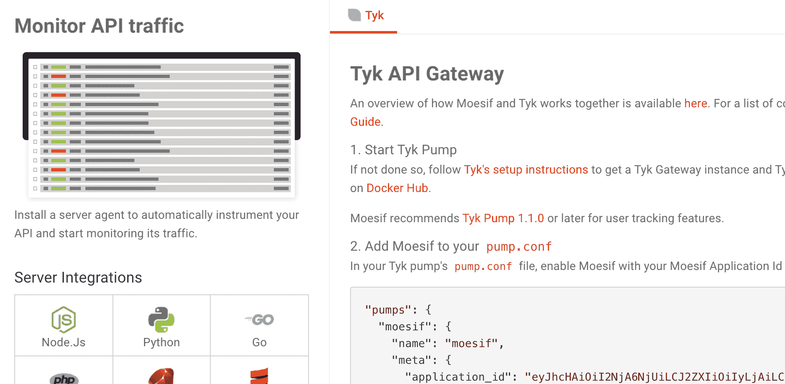

# 如何在带有 Moesif 的 EC2 上使用 Tyk API Gateway 监控 API 使用情况和性能

> 原文:[https://www . moes if . com/blog/technical/Tyk-API-Gateway/How-to-Monitor-Usage-And-Performance-with-Tyk-API-Gateway-on-AWS-EC2-with-moes if/](https://www.moesif.com/blog/technical/tyk-api-gateway/How-to-Monitor-Usage-And-Performance-with-Tyk-API-Gateway-on-AWS-EC2-with-Moesif/)

本文介绍了 API 可观测性，以及它在整个 APIOps 周期中的作用。然后，我们将通过一个例子来说明如何在[亚马逊 EC2](https://aws.amazon.com/ec2/) 上成功部署和利用 [Tyk 网关](https://tyk.io/)和 [Moesif API 可观察性](https://www.moesif.com/?language=tyk-api-gateway)。

## 什么是 API 可观测性？

API 可观察性是正确执行 APIOps 循环并确保为 API 用户构建有价值的东西的关键要素。如果你对 APIOps 周期不熟悉，看一看本指南中的[，它提供了一个敏捷框架来快速构建面向业务和服务于客户需求的 API。](https://www.apiopscycles.com/)

传统的监控侧重于跟踪*已知的未知*。这意味着你已经知道测量什么，比如每秒的*请求*或每秒的*错误*。虽然度量值可能事先不知道，但是您已经知道要测量或探测什么，比如一个计数器来跟踪桶中的请求。这使得可以报告系统的健康状况(如红色、黄色、绿色)，但对于解决工程或业务问题(通常需要询问任意问题)来说，这是一个糟糕的工具。

API 可观测性源于控制系统理论，通过推断状态和行为，从系统的输出尽可能多地观察系统的内部工作。有了一个复杂的分析工具来分析所有这些数据，您就能够回答任何关于您的 API 行为的任意问题，而不仅仅是一些可直接测量的预定义指标。

像 [Moesif](https://www.moesif.com/) 这样的 API 可观察性解决方案旨在弥合监控特定预定义指标与产品或业务整体健康状况的一般可观察性之间的差距。关于 API 可观察性与监控的更多信息，参见[这篇文章](https://www.moesif.com/blog/api-engineering/api-observability/What-is-the-Difference-Between-API-Observability-vs-API-Monitoring/)。

## 关于 Moesif 和 Tyk

像 Tyk 这样的 API 网关使您能够安心扩展和保护您的 API 组合。Tyk 的架构以 Go 编写，采用模块化即插即用方法，使您能够添加符合您要求的组件。Tyk 提供了许多现成的插件，这样您就可以开始运行了，身份验证、速率限制和跨源共享都已经处理好了。

Tyk 拥有许多分析后端的插件，无论是基于 ElasticSearch 等开源技术的 DIY 构建，还是像 [Moesif API Observability](https://www.moesif.com/?language=tyk-api-gateway) 这样的托管服务。Moesif 是一个专为 API 产品设计的可观察性平台，并与 Tyk 紧密集成，以收集额外的上下文，如认证用户(AliasId 或 OAuthId ),这样您就能够深入了解客户使用指标，并了解他们在采用您的 API 时的不足之处。

使用 [Moesif Tyk 插件](https://www.moesif.com/implementation/log-http-calls-from-tyk-api-gateway?useCase=incoming&step2entity=user#events)，您的 API 日志将被发送到 Moesif，Moesif 将对这些日志进行分析，并提供使用情况的[报告](https://www.moesif.com/solutions/track-api-program?language=tyk-api-gateway)。Moesif 还处理有效载荷信息，这样您就能够了解特定 JSON 键的使用情况，等等。关于 Moesif 和 Tyk 如何合作的更多信息，请参见 [Tyk + Moesif:完美的组合](https://tyk.io/tyk-moesif-the-perfect-pairing/)。

<noscript></noscript>


### 动态采样和治理

Tyk pump 的 Moesif 插件还支持 Moesif 的[动态采样](https://www.moesif.com/docs/platform/dynamic-sampling/)和[治理](https://www.moesif.com/docs/api-governance-rules/)特性。这使得基于 Moesif 中的用户行为规则或正则表达式规则对 API 流量进行采样变得容易，因此您可以节省 Moesif 订阅成本。Moesif 仍将外推原始指标以获得准确的报告。关于如何工作的更多信息，请参见 [Moesif 基础设施指南](https://www.moesif.com/enterprise/api-analytics-infrastructure)。

## 如何在 AWS 上设置 Moesif 和 Tyk

### 如何在 EC2 上安装 Tyk 网关

在这个例子中，我们使用 EC2 上的 Marketplace AMI 安装 Tyk。根据您的要求，Tyk 有三种选择:

*   [**PoC**](https://aws.amazon.com/marketplace/pp/prodview-elvk5mxxlkueu?qid=1575313242174&sr=0-4&ref_=srh_res_product_title)
*   [**【高可用性(双节点)**](https://aws.amazon.com/marketplace/pp/prodview-nempvlrcr4fq4?qid=1575313242174&sr=0-3&ref_=srh_res_product_title)
*   [**【自动缩放(3+节点)**](https://aws.amazon.com/marketplace/pp/prodview-2bgdxbpeygf5w?qid=1575313242174&sr=0-5&ref_=srh_res_product_title)

对于本指南，我们将利用[高可用性(2 节点)选项](https://aws.amazon.com/marketplace/pp/prodview-nempvlrcr4fq4?qid=1575313242174&sr=0-3&ref_=srh_res_product_title)，但是如果您想要 3 个以上的节点，过程是类似的。不建议将 PoC 版本用于生产。

*如果 AMI 不符合您的要求，您还可以使用 GitHub* *上的* [*docker compose 文件在*](https://github.com/Moesif/tyk-pro-docker-demo) [*亚马逊弹性容器服务*](https://aws.amazon.com/ecs/?whats-new-cards.sort-by=item.additionalFields.postDateTime&whats-new-cards.sort-order=desc&ecs-blogs.sort-by=item.additionalFields.createdDate&ecs-blogs.sort-order=desc) *上设置 Tyk 和 Moesif。*

1.  转到 AWS Marketplace 上的 [Tyk 列表](https://aws.amazon.com/marketplace/pp/prodview-nempvlrcr4fq4?qid=1575313242174&sr=0-3&ref_=srh_res_product_title)并点击右上角的黄色订阅按钮。这将启动 AMI 的设置过程。亚马逊正在处理你的请求，你需要等几分钟。一旦完成，点击黄色的*继续配置右上方的*。

<noscript></noscript>


1.  您需要确认交付方法是“Tyk Pro 高可用性 API 管理”，选择您的 AWS 区域，然后单击右上角的*继续启动*按钮。您需要确认一切，并选择底部的启动。

2.  在 CloudFormation create stack 面板上，您需要保留预先填充的设置，然后选择 Next。

<noscript></noscript>


1.  在 stack details 面板上，您需要填写所有参数，包括各种组件、子网和 SSH 密钥的管理员用户名和密码。如果您还没有这样做，您可能需要预先生成它。关于如何填写的完整细节，请参见 Tyk 网站上的视频。

2.  等待创建 CloudFormation 堆栈。这可能需要一些时间。

<noscript></noscript>


1.  一旦完成，你应该能够卷曲网关。

```py
curl http://TYKElasticLoadBalancerALB-1234567879.us-east-1.elb.amazonaws.com/hello 
```

### 如何添加 Moesif 插件

既然您已经运行了 Tyk API 网关。您需要启用 Tyk Pump 中的 [Moesif 插件，并添加您的 Moesif 应用程序 Id。](https://www.moesif.com/implementation/log-http-calls-from-tyk-api-gateway?platform=tyk-api-gateway)

Tyk Pump 是一个异步组件，它将您的原始分析数据推送到 Moesif 进行分析。该插件完全支持 Moesif 的[动态采样](https://www.moesif.com/docs/platform/dynamic-sampling/)功能，让您轻松节省成本。

1.  注册一个[免费 Moesif 账户](https://www.moesif.com/)。在 onboarding 安装页面上，单击 Tyk Gateway 调出设置说明和您的`application\_id`。

<noscript></noscript>


1.  现在您已经有了 Moesif 应用程序 id，SSH 到上一步中创建的 EC2 实例中。Tyk 泵应该已经启动并运行。

2.  在您的`pump.conf`中，您需要添加您在上一步中获得的 Moesif 应用程序 Id 和配置，这样您的配置看起来像这样:

```py
"pumps":  {  "moesif":  {  "name":  "moesif",  "meta":  {  "application_id":  "Your Moesif Application Id"  }  },  } 
```

1.  如果您想要记录 HTTP 标题和正文，请确保在 tyk.conf 文件中启用了[详细分析记录](https://tyk.io/docs/analytics-and-reporting/useful-debug-modes/)。

2.  使用正确的 Moesif 帐户配置 Tyk Pump 后，您现在应该重新启动 Tyk Pump 和 Tyk Gateway 实例。

```py
sudo service tyk-gateway restart

sudo service tyk-pump restart 
```

1.  就是这样！点击几次 AWS ELB，这样 Moesif 就可以记录一些 API 流量。您应该看到 [API 日志](https://www.moesif.com/features/api-logs)出现在您的 Moesif 仪表板中。


## 同时使用 Moesif 和 Tyk

现在您已经设置了 Moesif 和 Tyk，让我们来创建一些报告。

### 监控 API 性能

我想到的第一个问题是*我的各种 API 如何执行*。要调出该报告，您需要登录 Moesif，进入*时间序列*，然后选择 *P90 延迟。*这将显示通过 Moesif 跟踪的所有 API 的 90%延迟指标。

像 Moesif 这样的 API 可观测性系统的一个关键组成部分是以任何属性为中心，而不管基数。在这种情况下，让我们在`Request.Route`上通过添加一个*组。这将通过 RESTful 路径分解我们的度量。由于 Moesif 是为 API 设计的，它会自动将 URI 标识符如`/items/1`和`/items/2`合并到一个更加分析友好的`/items/:id`。`*

<noscript></noscript>


### 了解客户 API 的使用

APIOps 周期中的一个关键步骤是衡量业务和技术 KPI 以实现您的目标。这意味着要深入了解谁在使用你的 API，以及它们是如何被使用的。Moesif Tyk 插件将把一个 [Tyk 令牌别名](https://tyk.io/simpler-usage-tracking-token-aliases-tyk-cloud/)映射到 Moesif 中的一个[用户 Id。这使得存储电子邮件、收入和其他客户统计数据等用户属性变得很容易。](https://www.moesif.com/docs/user-analytics/)

### 安装 Moesif 用户跟踪

为此，[在你的网站上安装 Moesif 的 browser-js SDK](https://www.moesif.com/implementation/track-user-behaviors-with-browser?platform=browser) 。为您的 Tyk 泵配置使用相同的应用 id:

```py
const moesif = require('moesif-browser-js');

moesif.init({
  applicationId: 'Your Moesif Application Id'
  // add other option here.
}); 
```

然后，我们可以识别用户，并在您获得这些信息后保存用户属性:

```py
moesif.identifyUser('12345', {
  email: 'john@acmeinc.com',
  firstName: 'John',
  lastName: 'Doe',
  title: 'Software Engineer',
  salesInfo: {
      stage: 'Customer',
      lifetimeValue: 24000,
      accountOwner: 'mary@contoso.com',
  },
}); 
```

虽然是可选的，但您也可以通过`moesif.track()`方法跟踪用户操作，如“登录”和“查看文档”,以更好地了解您的客户之旅。

### 创建使用情况报告

现在您已经保存了客户统计数据，让我们调出一个报告，显示按用户电子邮件细分的使用情况排名靠前的客户。转到 Moesif 中事件下的相同时间序列视图。然后选择`User.Email`，我们将显示每个客户的 API 流量。因为我们想要查看长期趋势，所以将时间间隔更改为 7 天，这样您就会得到如下所示的报告:

<noscript></noscript>


## 总结想法

拥有正确的 API 分析堆栈可以为您的工程和业务团队提供正确的可视性，从而做出明智的决策。Moesif 和 Tyk 共同合作，提供了一个保护和发布 API 的交钥匙解决方案，同时只需做一些配置更改，就可以获得一个完整的 API 可观察性解决方案。像 Moesif 这样的托管 API 分析服务大大降低了定制解决方案的构建和维护成本，因此您可以专注于构建优秀的 API。