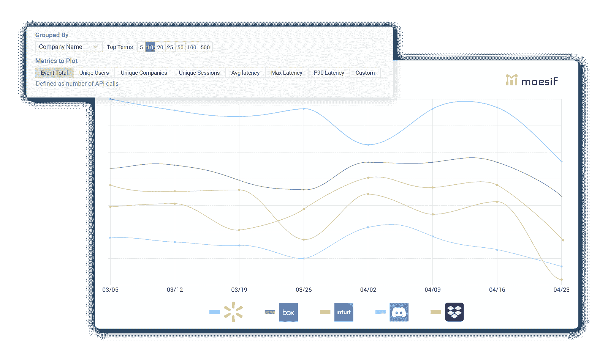

# 将 API 日志数据转换为可操作的信息

> 原文:[https://www . moes if . com/blog/API-engineering/API-observability/Convert-API-Log-Data-into-Actionable-Information/](https://www.moesif.com/blog/api-engineering/api-observability/Convert-API-Log-Data-into-Actionable-Information/)

您已经构建了一个 API 来解决技术问题，但您知道这只是开始。除了帮助开发者使用它，你还需要了解他们是如何使用它的。您希望衡量它的性能和受欢迎程度，并根据您的发现进行调整。

也许一些开发人员在进行 API 调用时看到了很多错误，或者他们花了太长时间才到达第一个“Hello World”也许转化为付费用户的开发者数量低于你的预期。你想了解你的 API 的用法，并确保客户长期使用你的 API。

此时，您可能会合理地查看您的 API 日志。您正在寻求对 API 及其用户的深入了解，但默认情况下，您将发现的是原始用法。你如何不仅能形象化用法，还能形象化帮助你采取行动的洞察力？这篇文章将介绍你如何自己解决这个问题，以及 Moesif 如何帮助你在 API 程序中更快地前进。

## 您的 API 日志包含大量可操作的信息

您可以从 API 日志中获得的大量有价值的信息可能会让您大吃一惊。例如，您可以使用 API 日志数据来[回答](https://www.moesif.com/features/api-logs)大量关于您的 API 的问题，例如:

*   发送的请求和响应负载是什么？
*   哪个 API 版本使用最多？
*   API 在哪里经历了更高的延迟？
*   导致 POST /*/count/events 错误的事务顺序是什么？
*   哪些 SDK 最常用于访问 API？

您还可以使用 API 日志数据来[回答](https://www.moesif.com/features/api-analytics)关于您的 API 用户的问题，例如:

*   我的每个客户使用的顶级端点是什么？
*   根据 API 使用情况，谁是我的主要客户？
*   哪些用户正在从 API 中抓取大量数据？
*   哪些客户遇到了 401 未授权错误？
*   特定客户的 API 活动是什么？

您的 API 日志包含有价值的信息，您可以利用这些信息为您的客户和业务带来好处。但是如何访问和分析日志数据呢？

许多 API 产品开发团队寻求 API 日志和度量的第一个工具是 Kibana。

## 你可能用管道把你的原木输送到基巴纳

如果您想从 API 日志数据中获得洞察力，那么您可能会将这些日志通过管道传输到 Kibana。如果您不熟悉的话，Kibana 是最流行的日志可视化工具之一。它是 [Elastic Stack](https://www.elastic.co/what-is/elk-stack) (以前是 ELK Stack)的一部分，后者由三个开源项目组成:Elasticsearch、Logstash 和 Kibana。Elasticsearch 是一个基于 Apache Lucene 的搜索和分析引擎。Logstash 是一个服务器端数据处理管道。Kibana 让你探索和可视化弹性搜索数据。

像任何堆栈一样，您需要将各个部分放在一起。虽然它们可以很好地协同工作，但是这三个工具也可以分开使用。您需要从 UI 到 API 将客户旅程数据缝合在一起。这些痕迹，用 Kibana 术语来说，对于将数据转化为可操作的东西非常重要。这并不像连接日志和完成工作那么简单——您需要确定需要什么，处理冲突，并承担索引增长的持续成本。

Kibana 是一个日志可视化工具，这使得它成为考虑 API 分析的合适起点。然而，Kibana 的主要用例是基础设施监控和度量。它不是专门为 API 产品设计的，所以使用 Kibana 进行 API 日志和度量有一些缺点。

## Kibana 对于 API 日志和指标的利弊

如果您已经构建了一个 API 产品，您可能已经使用 Kibana 来深入了解它的性能或开发人员如何使用它。也许您正在考虑使用 Kibana，因为它在日志可视化方面很受欢迎。不管是哪种方式，了解使用 Kibana 进行 API 日志和分析的优缺点都是有帮助的。

### Kibana Pros

Kibana 的优点包括:

*   开源，免费使用。
*   擅长可视化 API 日志。
*   您可以探索大量的日志数据。
*   许多有用的功能。尽管需要注意的是，有些功能是单独提供的，有些功能目前还处于试验阶段或测试阶段。
*   它位于 Elasticsearch 之上(也是一个缺点)，非常适合用于高基数、高维日志数据——这是 API 日志的必备特性。

现在说说缺点。

### 基巴纳监狱

基巴纳的缺点包括:

*   仅与 Elasticsearch 和 Logstash 兼容。如果您想将 Kibana 与其他数据库一起使用，那么您就不走运了
*   专为基础设施指标而设计，而不是专门为 API 产品而设计。您必须为 API 日志用例定制 Kibana。
*   将用户行为和 API 活动连接到一个单独的旅程中是非常手工的，并且随着时间的推移容易出错。您需要使用 Kibana 查询语言(KQL)或 Lucene 查询语法(Kibana 遗留查询语言)进行查询，因此有一个中等至高的学习曲线。
*   维护弹性堆栈需要很大的努力。例如，你必须定期升级堆栈的每个部分，并确保升级不会破坏你正在使用的任何插件，或者要求你重写任何可视化。

当从 API 日志中获得洞察力时，可视化只是一个起点。虽然 Kibana 非常擅长可视化日志，但它经常让你想知道，“下一步是什么？”根据这些数据，我应该采取什么行动？

## 超越 Kibana，使用 Moesif 从 API 日志中获得可操作的见解

Moesif 不仅仅是日志可视化，我们从您的 API 日志中提取可操作的信息，并指导您如何使用它。Moesif 是一个用户行为 API 分析和监控服务，具有快速查询引擎和基于事件的结构化数据。我们为 API 产品设计了平台，因此我们支持各种 API 协议，包括 REST、GraphQL、JSON-RPC、超媒体(HATEOAS)和 SOAP。

使用 Moesif，您可以过滤和聚合几乎任何字段上的数十亿 API 调用和用户操作，甚至是像会话令牌或用户 id 这样的高基数字段。

Moesif 平台包括许多您在 Kibana 和 Elastic Stack 中找不到的特性和功能，例如:

*   高基数、高维度的 API 指标**与任何数据库**兼容，而不仅仅是 Elasticsearch。
*   REST 和 GraphQL APIs 的自动分析。
*   自动洞察查询参数和 HTTP 文本负载，如 JSON 和 XML。
*   跟踪 API 调用、用户操作和行为以及网站活动。
*   嵌入式 API 日志和图表。

有关更多详细信息，请参见 [Moesif 与 Kibana](https://www.moesif.com/compare-to/kibana-and-elk-stack) 的完整对比。

Moesif 允许您从 API 日志中获取有价值的信息，并通过定制和预构建的仪表板帮助您了解数据告诉您什么。

## 理解 API 日志数据告诉你什么

如果您不理解数据告诉您什么，那么从 API 日志中提取数据不会有太大帮助。Kibana 和 Moesif 都提供了定制的仪表板，帮助您理解从 API 日志中获得的数据。然而，与 Kibana 不同的是，Moesif 具有专门为 API 产品设计的预建仪表板，以及嵌入式模板和公共共享链接。您可以使用我们预先构建的仪表板或构建您自己的[自定义仪表板](https://www.moesif.com/features/api-dashboards)，以更好地了解您的 API 日志数据告诉您的信息。

例如，一家金融科技公司(也是 Moesif 的客户)[创建了一个仪表板](https://www.moesif.com/blog/dashboards/technical/Self-Service-Custom-API-Dashboards-Allow-You-to-Easily-Track-and-Share-Key-API-Metrics/)，让他们跟踪关键的 API 和用户指标，其中包括:

*   最近的 API 错误
*   HTTP 状态请求
*   产品用途
*   每日活跃用户(DAU)
*   最活跃的用户

通过仪表板，fintech API 产品团队可以看到他们的客户是谁，他们如何将 API 与应用程序集成，以及他们的 API 的用户正在经历什么。该团队还深入了解了他们的 API 的执行情况，以及有多少开发人员从 API 的试用或沙盒版本转移到了生产版本。

## 不要错过宝贵的见解

您需要超越日志可视化，转向用户行为 API 分析，以便从 API 日志数据中获得可操作的见解。

想进一步了解 Moesif 如何帮助您从 API 日志中获得深刻的见解吗？

使用 Moesif API Analytics 开始构建优秀的 API。[了解更多](https://www.moesif.com/)。