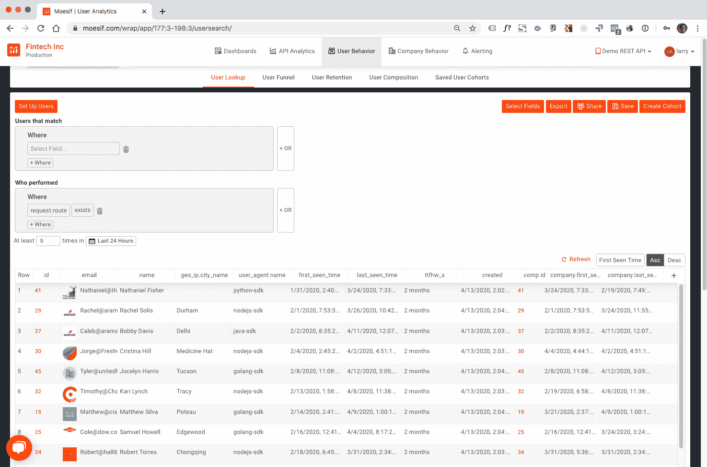
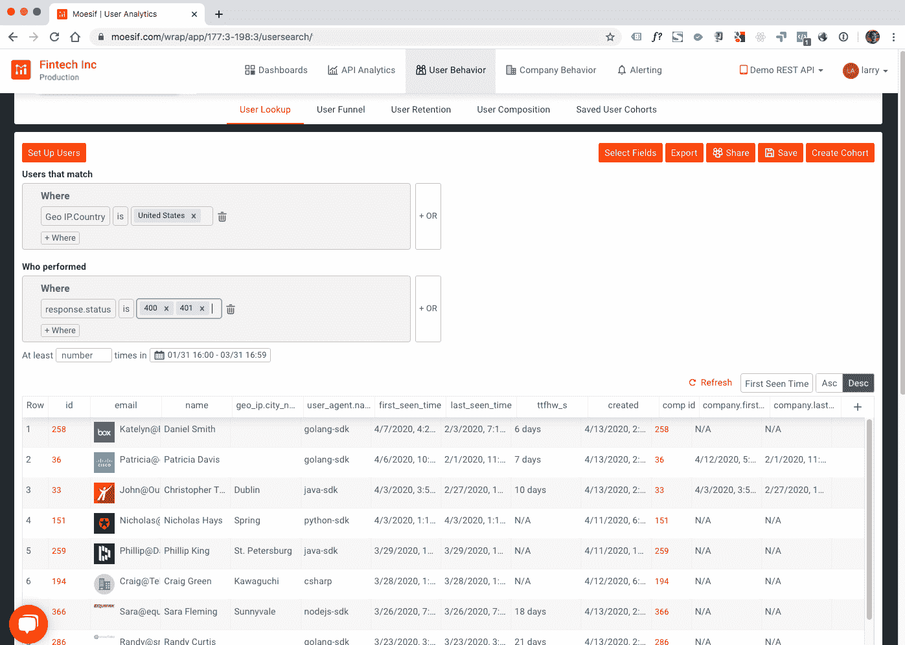
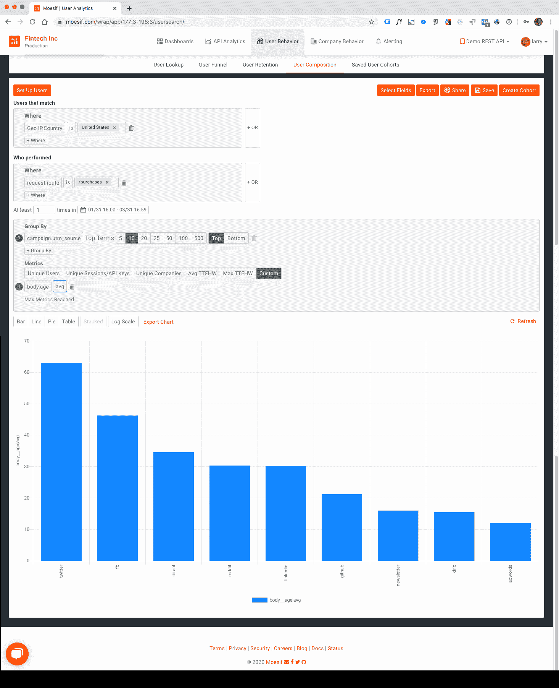

# 利用 API 分析平台的用户行为分析

> 原文:[https://www . moesif . com/blog/announcements/features/leveling-User-Behavioral-Analytics-For-API-Analytics-Platforms/](https://www.moesif.com/blog/announcements/features/Leveraging-User-Behavioral-Analytics-For-API-Analytics-Platforms/)

行为分析揭示了用户在你的产品中采取的行动。从一开始，Moesif 就将原始事件数据、特定的 API 调用组织成每个用户行为或旅程的时间线。其中最著名的例子是我们追踪新用户转化的[漏斗视图](https://www.moesif.com/blog/technical/api-analytics/Mastering-API-Analytics-for-API-Programs-Chapter-1/):注册>第一个 API 调用>第一个工作应用。

我们现在已经增强了我们的用户和公司过滤功能，因此您可以超越按客户人口统计和其他传统属性进行的典型分析，而是专注于了解用户如何行动以及他们为什么执行这些行动。相反，用户行为使您能够了解跨多个 API 调用的复杂用户交互事件，或者客户进行这些调用的频率，而不是关注单个值的时间序列指标。

> 担心上周 API 调用(400 或 401)失败的美国公司？

## 行为过滤器

我们刚刚在用户查找和公司查找下完成了一个相当大的更新。新功能包括:

*   动作:过滤公司或用户，不仅通过人口统计，还通过*动作*——他们在你的 API 上做了什么
*   数量:在特定的时间范围内有多少行动
*   组合:可以使用 AND 和 OR 函数一起检查多个动作
*   图形化:过滤不仅在 lookup 中受支持，在复合视图中也受支持

查看行为过滤器灵活性的最佳方式是通过用例的图解:

### 用例 1:显示在过去 24 小时内进行了至少 9 次 API 调用的所有用户

<figcaption>User Behavioral Lookup: Requests Performed In Last 24 Hours</figcaption>

### 用例 2:向我展示上一季度美国所有 API 调用失败的用户

<figcaption>User Behavioral Lookup: Failed API Requests in Last Quarter</figcaption>

### 用例 3:按营销活动渠道绘制的图表所有购买的美国用户，按 API 的年龄

<figcaption>User Behavioral Composition: Purchases by Campaign Channel</figcaption>

## 结论

随着 Moesif 行为过滤器的发布，您现在可以使用简单的下拉菜单和查询框来询问复杂的数据问题:

> 想要通过活动来源识别在过去 3 天内提出 3 次购买请求的用户？

有了行为过滤器，产品经理现在可以对功能做出更具洞察力的决策，营销人员现在可以在正确的时间向正确的用户群提供正确的产品。