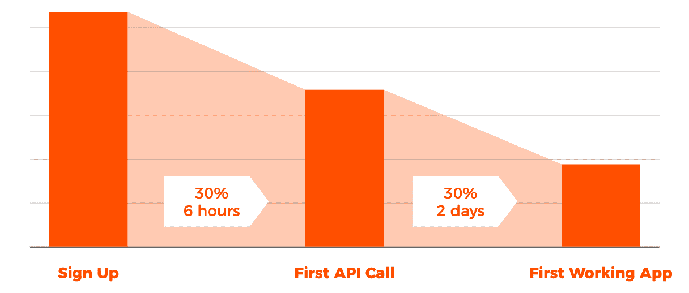
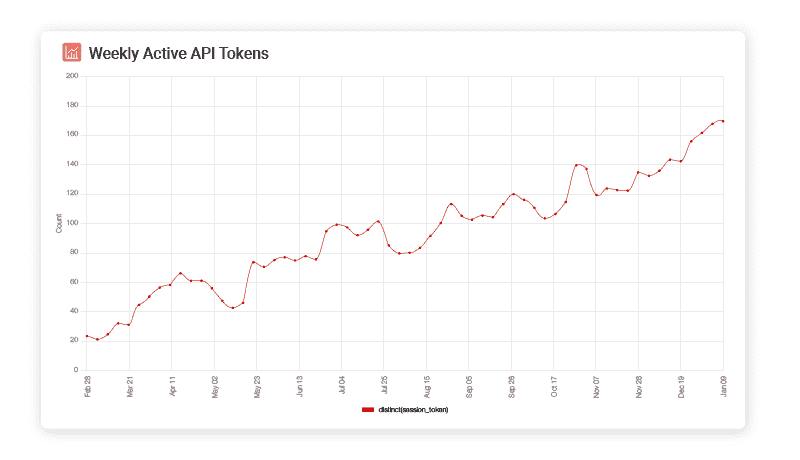
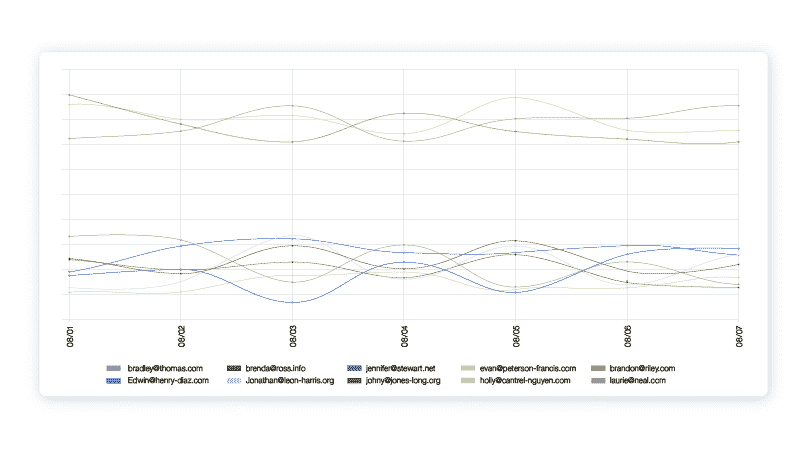

# API 监控对 API 产品经理和成长团队意味着什么

> 原文:[https://www . moes if . com/blog/API-Product-management/API-metrics/What-Does-API-Monitoring-Mean-For-API-Product-Managers-and-Growth-Teams/](https://www.moesif.com/blog/api-product-management/api-metrics/What-Does-API-Monitoring-Mean-For-API-Product-Managers-and-Growth-Teams/)

如今，无数工程团队已经利用 API 监控来跟踪基础设施的健康状况，并在服务停止或不健康时进行报告。可以跟踪各种与工程目标一致的 API 指标，如正常运行时间、平均延迟、每分钟请求数和每分钟错误数。然而，这些指标与产品所有者和增长团队的业务目标不一致。这篇文章介绍了如何利用 API 监控工具来促进您的业务增长和产品路线图。

## 甲板版本

[//www.slideshare.net/slideshow/embed_code/key/45xC73Vj8oiMLT](//www.slideshare.net/slideshow/embed_code/key/45xC73Vj8oiMLT)

**[What Does API Monitoring Mean for Product Managers?](//www.slideshare.net/DerricGilling/what-does-api-monitoring-mean-for-product-managers "What Does API Monitoring Mean for Product Managers?")** from **[Derric Gilling](https://www.slideshare.net/DerricGilling)**

## 业务目标概述

作为产品经理，您的目标通常符合以下三个方面之一:

1.  采用
2.  约会
3.  保留

根据产品的状态，公司关注不同的领域。在一个 API 发布时，采用可能是你的第一要务，因为当没有人首先知道你的 API 时，很难优化参与和保留。一旦你尝试了采用，并且有一小群用户测试了你的 API，你就可以开始寻找提高参与度和保持度的方法，这可以通过优化 onboarding 来实现，确保正确的产品特性存在，并且对用户有价值。一旦你看到参与度和保持度指标处于良好水平(即一小群忠实用户)，你就可以转而专注于采用，因为你现在可以*双倍下注*一个正在工作的产品。

### 1.采用

采用侧重于 API 的漏斗增长。推动采用的方法取决于您正在创建的 API 的类型。对于内部 API，您可以向公司中能够利用它的其他部门和团队宣传该 API。对于公共 API，您可以利用付费广告和内容的组合以及直接推广。

### 2.约会

一旦你有一群用户注册并测试你的 API，你就要确保你能推动产品参与度(即使用度)毕竟，那些产生大量兴趣和注册，但不能维持高产品使用度的 API 有失去投资的风险。任何项目计划都是为了给用户创造价值而发起的，无论这些用户是内部团队，还是外部客户和合作伙伴。

### 3.保留

保留类似于参与，除了它跟踪一群用户的参与随时间的衰减函数。在三个产品指标中，保留率是产品/市场契合度的最佳替代指标之一，因为它排除了外部因素，如由超大规模销售和营销预算推动的高采用率。如果你有一个忠诚而有粘性的产品，那么留存率会比一个漏船的产品高。

## 1.监控 *API 采用情况*

跟踪开发人员对 API 产品的采用类似于对其他产品的采用，最好用漏斗来完成。*开发者漏斗*跟踪用户从最初注册到使用你的 API 发布一个可用应用的旅程。与衡量移动应用获取的其他漏斗不同，API 用户可能会在一个漏斗阶段停留数天或更长时间。这意味着你不仅要跟踪每一步的转化率，还要跟踪到达下一步所需的时间。

#### 在您的漏斗中跟踪的推荐步骤:

1.  **预集成阶段**:用户注册或生成 API 密钥。
2.  **沙盒阶段**:用户进行了第一次 API 调用。从阶段 1 到这个阶段的时间可以称为到第一个 Hello World 的时间(TTFHW)
3.  **生产阶段**:用户部署了他们的全功能应用程序，创造了一些有价值的东西。从前一阶段到这一阶段的时间可以称为第一个工作应用程序的时间(TTFWA)

通过分阶段规划您的采用流程，您可以发现产品中需要改进的地方。F

对于许多 API 平台来说，缺少文档和简单的入门会降低 TTFHW 的速度。这可以包括

*   包含许多整合步骤的漫长入职流程
*   没有针对需要额外开发的编程语言或框架的 SDK
*   劣质或过期的文档。大多数开发人员喜欢在集成之前对 API 进行研究。

另一方面，开发商控制之外的其他内部利益相关者会降低 TTFWA 的速度，例如:

*   法律和合规风险
*   项目优先级
*   性能测试和安全审查的阻止程序

## 2.监控 *API 使用*

一旦用户采用了你的 API，你就想要提高参与度和使用率。

### 虚荣度量

明智地选择您的指标，不要落入虚假(即虚荣)产品指标的陷阱。虽然许多营销团队负责*页面浏览量*和*注册量*，但这些指标只衡量漏斗顶端，而不是产品本身的成功。你甚至可以有一个没有任何产品的登陆页面，仅仅通过一大笔广告预算就能获得大量注册。类似地，有许多基础设施指标与工程目标而不是产品目标相一致。例如，每分钟增长的*请求*指标可能意味着一个成功的产品，但是由于大量的健康调查或机器人流量，增长可能是人为的高。甚至*平均延迟*也不是衡量产品性能的最佳指标，因为持续缓慢的 API 可能是好的，不像加载缓慢网站的体验。

### 推荐的参与度指标

#### 每周活动 API 令牌

*每周活跃 API 令牌*，即在给定的一周内访问 API 的不同令牌的数量，是跟踪 API 产品的最佳北极星指标之一。因为单个开发人员帐户可以创建多个 API 令牌，例如用于沙盒和生产环境，所以更准确的衡量标准是每周活跃用户或每周活跃公司。但是，这需要能够将 API 令牌链接到相应用户或公司帐户的分析基础架构。

当一个开发者注册使用你的 API 时，你也应该[跟踪引用的域和 UTM 参数](/blog/business/acquisition/How-to-Measure-Developer-Acquisition-with-API-Analytics-and-UTM-Parameters/)。这使您能够按 UTM 来源或 UTM 活动对每周活动令牌进行分组，以更好地了解有助于使用和参与增长的营销渠道。

#### API 流量排名靠前的客户

了解你的 API 的顶级消费者有助于你了解你最有价值的用户想要什么。通过按端点或特性对其进行细分，您可以查看二级指标，例如哪些端点最受参与用户的欢迎，但没有被那些没有真正使用您的 API 的用户所利用。可能有一小部分非常有价值的特性需要更多的曝光。

#### 第 90 百分位延迟

平均延迟可能是一个错误的指标，因为它没有显示延迟的变化。大多数使用您的 API 的用户可以处理持续高延迟的 API，因为它是可预测的。然而，延迟差异很大的 API 更难使用。延迟变化会导致发送错误警报，触发代码中的竞争条件，并使容量规划变得更加困难。衡量这一点的一种方法是通过第 9x 百分位延迟。您还可以根据客户、端点或其他数据进行分组，以找到延迟差异最大的热点。

## 3.监控 *API 保留量*

一旦你对采用和参与有了很好的理解，研究 API 产品留存以发现产品中需要改进的地方是很重要的。产品留存是一个从收入留存中诞生的概念，需要将你的用户群分成不同的群组，比如通过注册日期。然后，您跟踪每个群体返回到您的平台的百分比。

虽然所有的留存曲线都是向下倾斜的，因为没有产品能保证在注册后 100%的留存，但提供长期客户价值的好产品的留存曲线随着时间的推移会接近非零平衡，如上图所示。然而，不符合产品/市场的不良产品将表现出向下倾斜到零的保留曲线。这意味着你有一艘漏水的船，在进一步投资采用之前，应该优先解决你的产品保留问题。否则，你只是在浪费时间和金钱来获取那些不会留下来的用户。

在上述指标中，我们探索了按用户 SDK 分组的 API 保留。我们可以看到 PHP 比其他 SDK 的留存率低得多。这可能意味着 PHP 有问题或者有一些需要修复的性能问题。

## 结束语

让开发者采用你的 API 很难。它需要对开发者想要什么有一个好的直觉，同时不要让个人偏见成为障碍。构建开发人员真正喜欢的产品的两种最佳方式是通过 1。查看真实的使用数据和 2。客户发现和调查。拥有定性和定量数据对于规划和投资正确的产品计划非常重要。