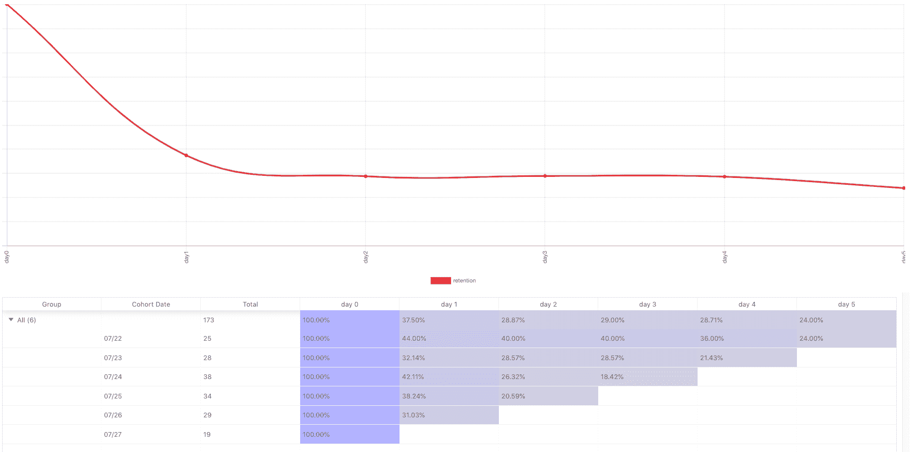
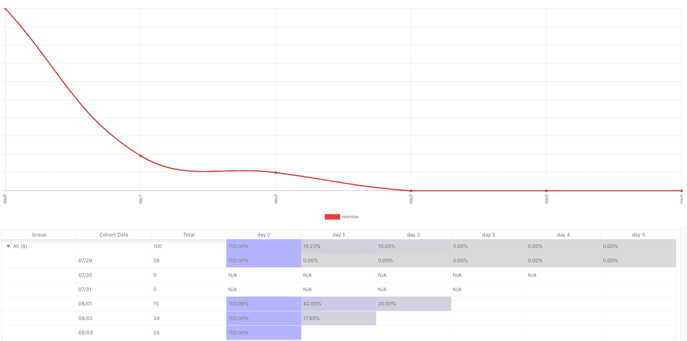
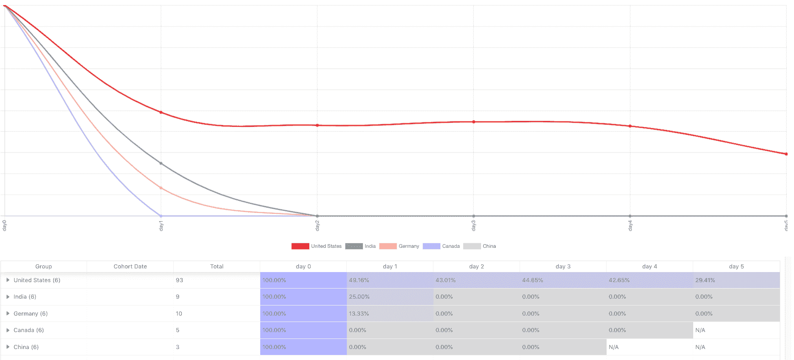

# 掌握 API 程序的 API 分析:群组保持分析

> 原文:[https://www . moesif . com/blog/technical/API-Analytics/Mastering-API-Analytics-for-API-Programs-Chapter-2/](https://www.moesif.com/blog/technical/api-analytics/Mastering-API-Analytics-for-API-Programs-Chapter-2/)

对于平台业务来说，很少有指标比留存率更重要。如果你以 25 美元获得客户，但是他们在一个月后停止使用你的 API，那么你就有一艘*漏船*。在留住人才的问题解决之前，不要在开发人员获取上花更多的钱。这需要准确测量原料药的保留率。

如果你来自网络或移动产品背景，你可能已经熟悉了*移动留存*来衡量有多少获得的用户保持使用一个移动应用。发展 B2B 平台需要跟踪类似的 KPI 来衡量你的收购和产品策略的成功。本文将深入探讨跟踪和提高 API 保持率的最佳实践。

## 什么是 API 保留？

保持率衡量的是一群人中再次使用你的产品并保持活跃的用户的百分比。对于您的产品，什么被认为是有效的取决于产品的类型。对于流媒体移动应用程序来说，在某一天活跃可能意味着播放一首歌曲。对于一个支付 API，它可以在一天中处理一次信用卡支付。

为了准确地测量用户保持率，你需要将你的用户分成不同的群体。通常，这是通过注册日期来完成的，但对于 API，建议根据集成日期或第一个 Hello World 的*时间来划分。这是用户第一次通过您的 API 集成并进行第一笔交易的日期。然后，每天、每周或每月，我们都会统计返回并执行某项操作的独立用户的数量，您认为这是*活跃的有力指标*。*

下图显示了按第一次 API 调用日期划分的新用户。从那里，我们跟踪每天仍然活跃在我们的 API 上的用户的百分比。该图表显示，37.5%的新用户在集成后的第一天仍然在积极地进行 API 调用。整合五天后，只有 24%的初始队列仍然活跃。

## 什么是良好的 API 保留率？

虽然只有 24%的群组在集成后 5 天内是活跃的，这看起来并不算高，但根据您的使用情况，此图表可能相当不错。留存不应衡量参与度或粘性水平。相反，您应该使用保留曲线来查看有多少用户被保留。最好的方法是判断曲线有多平坦。

**保留曲线持续下降直至达到 0%的产品保留性较差。然而，保留曲线变平或略微上升的产品具有良好的保留。**

第一天应该有最大的衰减。大多数平台都有一批注册的开发者，他们在沙盒里摆弄 API，但永远不会回来。一旦客户发现了价值，他们会在第二天、第三天继续使用 API，以此类推。这些用户发现了 API 的价值，并保持整合。另一方面，如果你的 API 或者 SDK 有问题或者不能提供即时的价值，开发者会逐渐移除他们的实现，导致留存率逐渐下降到 0%。

与上图不同，下图显示了糟糕的 API 保留情况。

请注意，在这种情况下，保留率一直下降到 0%。

## 按细分市场细分

以前，我们关注的是整个用户群。然而，要更深入地探究为什么保留率下降，重要的是找到驱动这种下降的变量。一种方法是将您的用户分组到桶中。这可以通过用户属性来划分，比如他们来自哪个国家，用户获取渠道，甚至是产品特定的信息，比如开发者使用的 SDK。

在这种情况下，我们可以更清楚地了解是什么推动了长期保留。虽然整体保留曲线相对平坦(即良好的保留)，但我们看到大多数非美国客户下降到 0%。只有美国用户继续利用 API。我们应该进一步调查为什么非美国用户不使用这个 API。是因为高延迟吗？非本地化文档？阻止收养的当地法律和法规？在金融、医疗保健和其他受监管的行业尤其如此。

## 定义初始和返回操作

从商业角度来看，退货行为应该是只有活跃用户才会做的事情，并从你的产品中获取价值。为了正确测量保持力，你需要定义初始动作和返回动作的*。虽然不是必须的，*初始动作*通常是新用户使用你的产品的第一个动作。*

以前，我们只是跟踪第一次进行 API 调用的新用户，然后进行任何返回 API 调用的*。然而，我们可以更具体地了解那些初始或返回动作是什么。*

例如，我们可以认为只有当用户返回并在 API 上进行支付交易时，用户才是活跃的。

### 例子

假设您正在构建一个管理信用卡交易的支付 API。API 提供的主要价值是通过信用卡处理支付，因此商家得到支付，因此我们考虑每天通过 API 处理至少一次信用卡支付的活跃用户。

对于 API，我们可以按如下方式跟踪留存率:

首次事件标准:

*   *第一次调用 API 的新用户*

返回事件标准:

*   *回来并至少进行了一笔支付交易*

## 结论

如果您打算构建一个不断增长的 API 程序，那么您应该跟踪许多更深入的 API 指标。然而，如果您还没有开始采用数据驱动的方法，这些指标是一个很好的起点。随着您的 API 程序的发展，您将跟踪其他 KPI，这些 KPI 可以显示您的 API 程序的健康状况。像 [Moesif API Analytics](https://www.moesif.com/solutions/track-api-program) 这样的工具可以帮助您通过快速安装 SDK 来开始测量这些指标。

*[参见本系列第 1 章:掌握 API 分析——开发者漏斗](/blog/technical/api-analytics/Mastering-API-Analytics-for-API-Programs-Chapter-1/)*