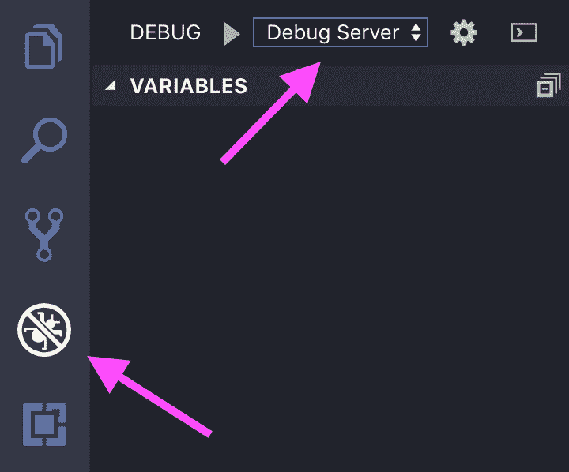

# 向您的 GraphQL API 服务器添加分析，并使用 VSCode 调试它

> 原文:[https://www . moesif . com/blog/technical/Debug/Add-Analytics-to-your-graph QL-API-Server-and-Debug-it-With-vs code/](https://www.moesif.com/blog/technical/debug/Add-Analytics-to-your-GraphQL-API-Server-and-Debug-it-With-VSCode/)

GraphQL 后端现在是 API 行业的必备工具。

GraphQL 让前端可以更好地控制后端通过网络发送的数据。仅这一功能就可以减少流量，从而节省资金并有助于慢速移动连接。

由于 GraphQL 比 REST 更好地指定，不同的 GraphQL 实现比 REST APIs 更能相互匹配，这使得它们更容易被前端开发人员所接受。

在本文中，我们将使用 Apollo-Server 构建一个 GraphQL 后端，并使用 Apollo-Servers 的**实验性**扩展系统创建一个自定义分析扩展。

## 为什么

GraphQL 在请求和响应之间添加了更多的库代码，所以如果能更深入地了解当有人从我们的 GraphQL 后端请求数据时会发生什么情况，岂不是更好？

自定义扩展可以挂钩到 GraphQL 请求的生命周期，并允许我们在分析工具和服务中使用这些信息。

我们还可以通过类似 VSCode 中包含的调试器来利用自定义扩展代码。

## 什么

[GraphQL](https://graphql.org/) 是 REST 的替代品。它是一种查询语言的规范，也是这种语言的实现。它让我们定义类型化的 API 端点，并允许客户端只请求他们需要的数据。

[Apollo Server](https://www.apollographql.com/docs/apollo-server/) 是在 Node.js 运行时上用 JavaScript 实现的 GraphQL 服务器规范。

[Visual Studio Code](https://code.visualstudio.com/) ，简称 VSCode，是一个用 JavaScript 编写的可扩展代码编辑器。它附带了一个用于 Node.js 应用程序的集成调试器。

## 怎么

为了让所有这些工作，我们需要安装 [Node.js](https://nodejs.org/en/) 和 [VSCode](https://nodejs.org/en/) 。

### GraphQL 服务器安装程序

要启动并运行一个简单的 GraphQL 服务器，我们必须创建一个新的 Node.js 项目。

```py
$ mkdir api-server
$ cd api-server
$ npm init -y 
```

我们还需要 NPM 的`apollo-server`和`graphql`包。

```py
$ npm i apollo-server graphql 
```

现在，让我们用 VSCode 打开`api-server`项目，这样我们就可以实现我们的服务器。

```py
$ code . 
```

我们需要一个新的`index.js`文件，代码如下:

```py
const { ApolloServer, gql } = require("apollo-server");

const typeDefs = gql`
  type Task {
    text: String
  }
  type Query {
    tasks: [Task]
  }
`;

const resolvers = {
  Query: {
    tasks: () => [
      { text: "Buy chocolate!" },
      { text: "Pay rent." },
      { text: "Wash dishes." }
    ]
  }
};

const server = new ApolloServer({ typeDefs, resolvers });

server
  .listen({ port: 9999 })
  .then(({ url }) => console.log(`Server running! ${url}`)); 
```

让我们一步一步来。

首先，我们需要 GraphQL 包，`apollo-server`配置并运行我们的 GraphQL 服务器，`graphql`解析我们将提供给`apollo-server`的模式定义。

然后我们定义了一个简单的模式，它只允许从我们的服务器查询任务列表，我们实现了一个解析器用于将任务数组发送回客户机的查询。

当我们使用以下命令启动服务器时:

```py
$ node . 
```

它将允许我们通过 [GraphQL Playground](https://www.apollographql.com/docs/apollo-server/features/graphql-playground.html) 发送 GraphQL 查询，这是脸书 GraphQL 服务器参考实现的默认[graph QL](https://github.com/graphql/graphiql)UI 的可选 UI。

要访问这个 UI，我们需要在浏览器中打开`http://localhost:9999/graphql`。

在 GraphQL Playground 的帮助下，我们现在可以查询任务，看看是否一切正常，服务器是否配置和设置正确。

```py
{  tasks  {  text  }  } 
```

如果一切正常，我们应该会收到以下响应:

```py
{  "data":  {  "tasks":  [  {  "text":  "Buy chocolate!"  },  {  "text":  "Pay rent."  },  {  "text":  "Wash dishes."  }  ]  }  } 
```

下一步是我们的分析扩展。

### 添加分析扩展

`apollo-server`包附带了一个 [**实验性的**扩展系统](https://www.apollographql.com/docs/apollo-server/features/metrics.html#Granular-logs)，它可以与他们的 GraphQL 服务器实现的不同生命周期事件挂钩。

我们可以利用它来构建一个定制的扩展，从`apollo-server`接收数据并以某种方式使用它。为了使本文简单，我们将使用我们的扩展记录请求的每个生命周期阶段。

为此，我们创建一个新文件`analyticsExtension.js`,其内容如下:

```py
class AnalyticsExtension {
  requestDidStart({ queryString, operationName, variables }) {
    console.time("requestDidStart");

    if (!!operationName) {
      console.log("OPERATION");
      console.log(operationName);
    }

    console.log("QUERY");
    console.log(queryString.trim());

    console.log("VARIABLES");
    console.log(variables);

    return (...errors) => {
      if (errors.length) {
        console.log("ERRORS");
        console.log(JSON.stringify(errors, null, 2));
      }
      console.timeEnd("requestDidStart");
    };
  }

  parsingDidStart() {
    console.time("parsingDidStart");
    return () => console.timeEnd("parsingDidStart");
  }

  validationDidStart() {
    console.time("validationDidStart");
    return () => console.timeEnd("validationDidStart");
  }

  executionDidStart() {
    console.time("executionDidStart");
    return () => console.timeEnd("executionDidStart");
  }

  willSendResponse(options) {
    console.log("willSendResponse");
    console.log(JSON.stringify(options.graphqlResponse, null, 2));
  }
}

module.exports = AnalyticsExtension; 
```

扩展是实现以下部分或全部方法的类:

*   `requestDidStart`
*   `parsingDidStart`
*   `validationDidStart`
*   `executionDidStart`
*   `willSendResponse`

所有这些方法，除了`willSendResponse`可以返回一个回调函数，当它们的生命周期阶段结束时，`apollo-server`将调用这个函数。它使用回调，因为这些阶段是异步的。

这样，我们可以在每个生命周期阶段定义两次回调。

在`requestDidStart`中，我们记录从客户端收到的查询数据，还设置了一些计时器，这样我们就可以检查如何记录服务器处理请求的时间。

在`parsingDidStart`、`validationDidStart`和`executionDidStart`中，我们只设置计时器来检查每个生命周期阶段执行了多长时间。

在`willSendResponse`中，我们记录了 GraphQL 服务器产生的响应。

现在，所有这些数据都将被记录在本地，但我们也可以将其发送到分析和监控服务，如 [Moesif](https://www.moesif.com/features/api-monitoring) 。

既然我们已经定义了我们的自定义分析扩展，我们必须将它连接到我们的 GraphQL 服务器。

为此，我们在`index.js`中扩展了`require`，并将一个新实例传递给`ApolloServer`构造函数的`extension`数组。

```py
const AnalyticsExtension = require("./analyticsExtension");

...

const server = new ApolloServer({
  typeDefs,
  resolvers,
  extensions: [() => new AnalyticsExtension()]
});

... 
```

当我们重启服务器并发送查询时，我们现在应该会看到我们的分析输出:

```py
QUERY
{
  tasks {
    text
  }
}
VARIABLES
{}
executionDidStart: 0.252ms
willSendResponse
{
  "http": {
    "headers": {}
  },
  "data": {
    "tasks": [
      {
        "text": "Buy chocolate!"
      },
      {
        "text": "Pay rent."
      },
      {
        "text": "Wash dishes."
      }
    ]
  }
}
requestDidStart: 1.558ms 
```

每个生命周期方法都记录它的时间，有些还记录在它的阶段中接收或产生的数据。

有了我们的定制分析扩展，我们现在可以去调试我们的系统。

### 使用 VSCode 调试

为了设置 VSCode 调试器，我们需要创建一个`.vscode/launch.json`来告诉 VSCode 如何启动我们的服务器。

```py
{  "version":  "0.2.0",  "configurations":  [  {  "type":  "node",  "request":  "launch",  "name":  "Debug Server",  "program":  "${workspaceFolder}/index.js"  }  ]  } 
```

如果我们在 VSCode 中打开 debug 视图，我们现在可以在左上角的下拉菜单中看到我们的*“Debug Server”*launch-configuration。



如果一切都设置正确，我们现在可以在`index.js`中加入我们的`resolvers`函数，在`analyticsExtenion.js`中加入`AnalyticsExtension`生命周期方法并设置断点。

如果我们遇到这些断点之一，我们可以使用 VSCode 的调试控件来导航我们的代码。例如，我们可以跳出我们自己的*扩展代码，进入调用我们的生命周期方法的函数。*


有了这个设置，我们现在可以在本地对我们的系统进行更多的控制，甚至当它运行在云中的某个地方时。

## 结论

Apollo 的 GraphQL 服务器实现为我们提供了一种非常方便的方法来集成我们选择的监控服务。扩展系统为我们提供了对请求生命周期阶段的粒度访问，因此我们可以测量我们的后端发生了什么。

与 VSCode 的调试器协同工作，我们可以使用自定义扩展代码来更好地理解我们的服务器在运行时采用的代码路径。

总而言之，这让我们更好地了解了我们的 GraphQL 服务器中正在发生的事情，以及我们未来可以改进它们的地方。