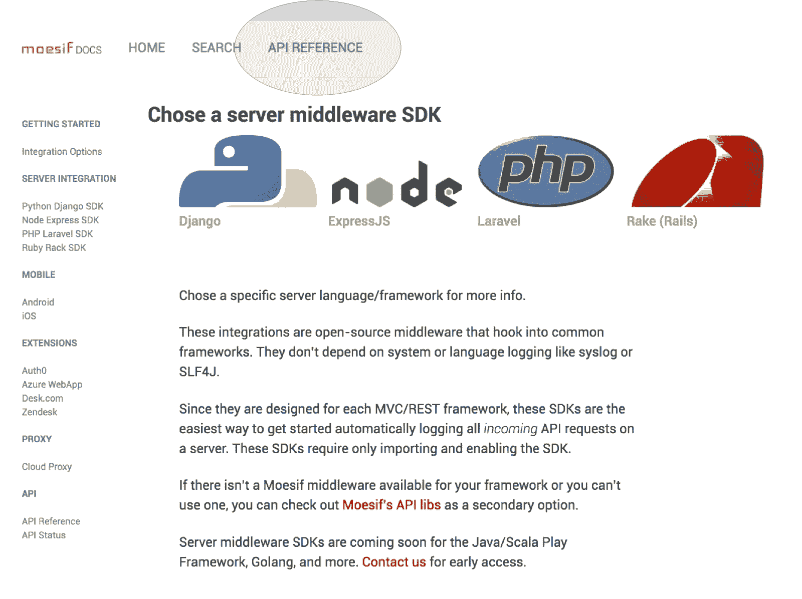
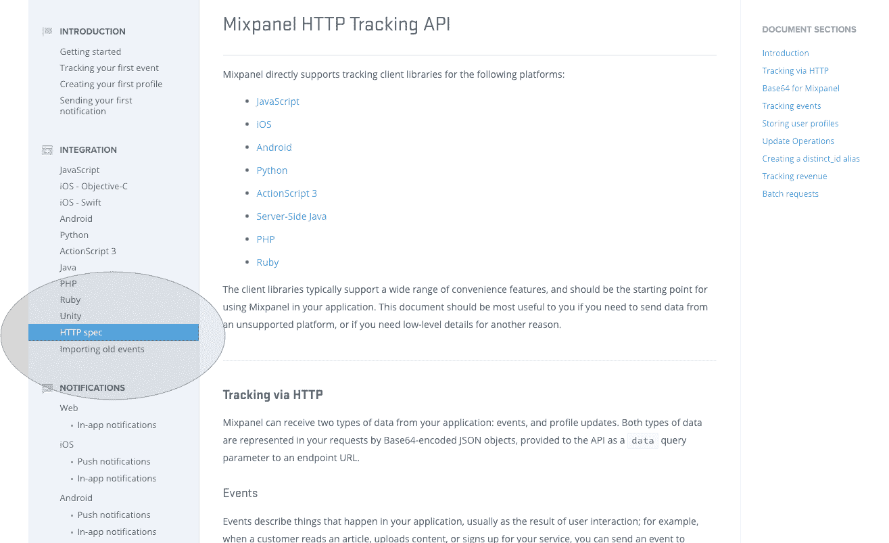
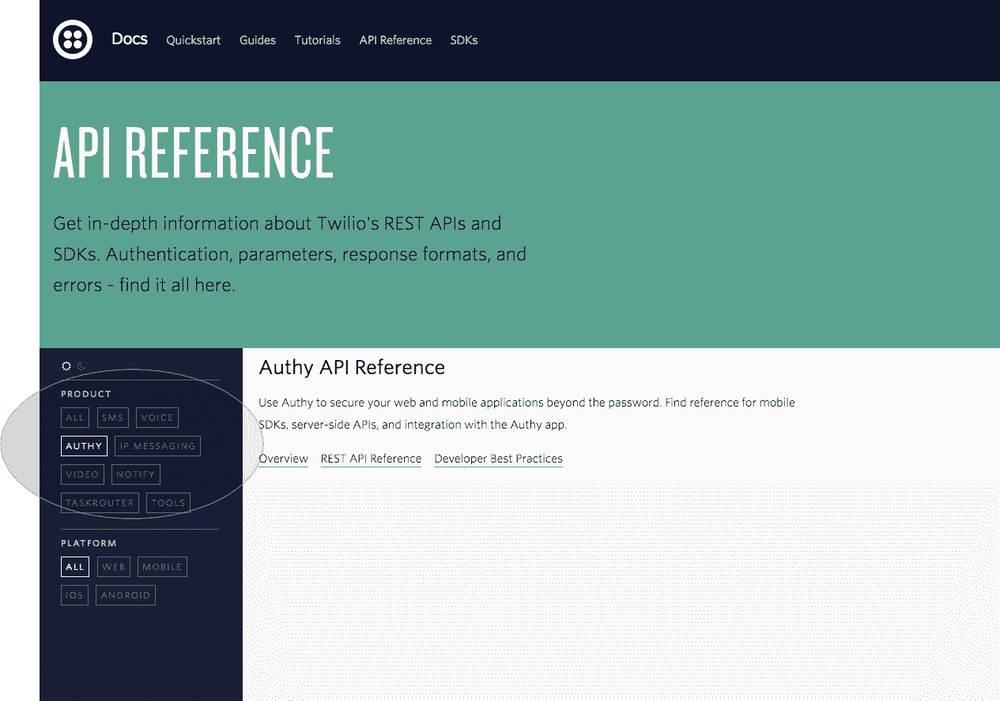
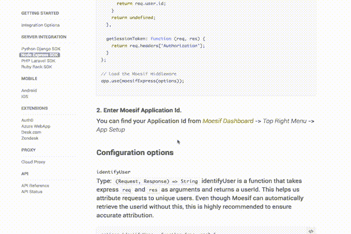
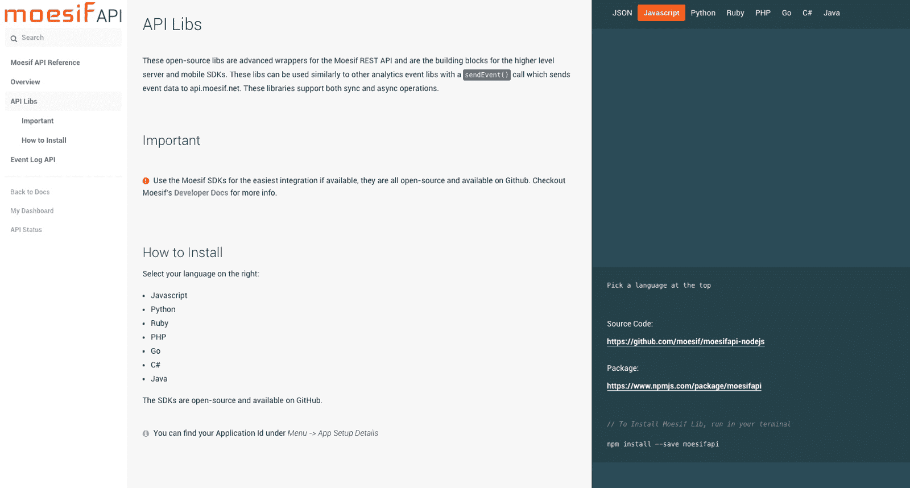

# 设计好的静态 REST API 文档

> 原文:[https://www . moes if . com/blog/technical/Documentation/Designing-Good-Static-REST-API-Documentation/](https://www.moesif.com/blog/technical/documentation/Designing-Good-Static-REST-API-Documentation/)

设计和编写好的开发人员文档可能是一项艰巨的任务，但对于任何 API 驱动或 business2developer 公司来说，这是确保开发人员成功的关键。您的文档也是您公司的营销资产，可能是新的潜在客户访问的前几页，以了解您的集成有多困难以及产品如何工作。

对于 Moesif，我们进行了大量的研究，以确保我们的文档组织和设计适当，并在本指南的下面发布了研究结果。诸如 Jekyll 和 GitBook 之类的实现将另文讨论。你可以在 www.moesif.com/docs 的和 www.moesif.com/docs/api 的看到结果。API 参考源位于 github.com/Moesif/apidocs

## 高层组织

在讨论具体的文档特性之前，有必要讨论一下文档的整体组织。每个公司对文档都有特定的要求，但是您可以通过查看其他公司的文档来获得一些想法，这些文档通常分为以下三类:

*   [1。具有独立 API 引用的集中文档](#centralized-docs-separate-api-ref)
*   [2。结合 API 引用的集中单据](#centralized-docs-combined-api-ref)
*   [3。分散单据](#decentralized-docs)

### 1。带有单独的 API 引用的*集中文档*

属于这一类的公司通常至少有两层文档:*开发者文档*和 *API 参考。*

#### 同时拥有文档和 API 参考的公司将文档访问者分为两类:

*   对高级集成或 SDK 感兴趣的开发人员
*   对原始 REST API 或 API 包装库感兴趣的开发人员

*主开发者文档*根本没有讨论 REST API，也没有讨论 API 包装库。取而代之的是，从文档到一个独立的 *API 参考*网站的导航链接。很多时候，API 参考使用了与文档的其他部分不同的设计或布局，例如 3 列与 2 列。然后，主要的开发人员文档将重点放在入门 api 指南以及如何使用或集成每个产品功能上。

遵循这种方法的公司可能非常注重 API 或开发人员，但已经有了更高层次的集成，因此不需要直接使用 API。这样的公司有 [Stripe](https://stripe.com/docs) 、 [Auth0](https://auth0.com) 、 [Moesif](https://www.moesif.com) 。例如，Stripe 有自己的 Stripe.js 和 Android/iOS SDK，与 REST API 相比，它们位于前端和中心。Auth0 有他们的 [Lock SDK](https://auth0.com/docs/libraries/lock) ，允许新开发人员在几分钟内启动并运行身份验证。而他们的 API 可供高级用户使用和定制。

[T2】](https://moesif.com/docs?utm_source=blog)

类似地，对于 Moesif，许多开发人员不需要直接使用 REST API，因为有更高级别的集成可以开始。因此，第一次访问文档的新 NodeJS 开发人员可能会对 *moesif-express* 中间件更感兴趣，而不是阅读原始的 *NodeJS API 包装器*库。看看[主开发者文档](https://www.moesif.com/docs/)和 [API 参考](https://www.moesif.com/docs/api)之间的主题差异如果 NodeJS 和 Express 中间件处于同一级别，新的开发者可能会对是开始使用 Express 中间件还是 NodeJS API 库感到困惑。请记住，虽然您可能对自己的 API 及其 SDK 非常熟悉，但新开发人员可能不熟悉。

#### 利益

*   可以引导新员工使用合适的入门指南，避免过多集成带来的困惑。
*   可以专门为文档类型设计导航布局。例如，API 引用可以是一个很长的页面，而一般的文档被分割成许多较小的网页
*   单独的 API 参考对于记录非常像 CRUD 的 REST APIs 很有用
*   为超级用户提供了一个优秀的书签化和 SEO 优化的 api 参考 URL，用于实体模式之类的东西，而无需深入研究冗长的 API 入门指南
*   API 参考站点可以使用单独的工具链，并利用 Swagger 之类的工具
*   对于在谁拥有 API 参考和开发人员文档& api 指南之间有明确责任划分的公司来说是理想的

#### 下降趋势

*   不适合具有单一集成层的公司
*   可以人为地强制 API 引用进入后台，这可能不是您的业务需求
*   对于拥有许多不同产品线的公司来说，集中式导航可能不太适合
*   简洁的 API 文档可能会吓跑非开发人员
*   像搜索这样的关键导航元素可以分散吗

### 2。集中文档*结合*和 API 引用

属于这一类别的公司将他们的 HTTP API 参考与他们的其他开发人员文档结合在一起，并且没有单独的 API 参考网站。很多时候，虽然 API 参考与其他开发人员文档结合在一起，但是有一个单独的非开发人员帮助区域。虽然情况并不总是如此，但出于讨论的目的，我将假设这是因为流行。

#### 合并开发者文档的公司通常将访问者分成至少一个群组:

*   可能使用 SDK、集成或原始 REST API 的开发人员
*   可选的非开发人员，他们只需要了解如何使用仪表板或产品。

Mixpanel 和 Amplitude 都非常接近这种方法。Square 也在此之后添加了 [Square 文档](https://docs.connect.squareup.com/)。

[T2】](https://mixpanel.com/help/reference/http)

这些公司面向开发者和非开发者进行营销。对于 Mixpanel 和 Amplitude，主要用户不一定是集成产品的开发人员。相反，Mixpanel 和 Amplitude 正在向对数据好奇的营销人员和产品经理推销他们的产品。Square 正在向商家和零售商推销他们的产品。这些公司推销的是产品的灵活性，而不是 API 的灵活性。

这些类型的公司可能需要面向开发人员和非开发人员的文档。添加第三层 API 引用会导致导航混乱或者吓跑主要用户。为什么？一个单独的 API 参考将创建三个级别的文档:*非开发者帮助*、*开发者文档*和 *API 参考。*

当集成 SDK 与 REST API 和 API 包装之间没有明显区别时，也可以使用组合文档。如果你所有的集成都是以 API 为中心的，而你不能干净地将你的集成分成以 *API 为中心的*和以*非 API 为中心的*两个桶，那么你可能会制造一个导航噩梦，如果你使用单独的 API 文档，很难在一个地方查看和搜索所有的集成。将 HTTP API reference 与其他 api-guide 相结合，可以让您轻松地将所有的操作指南集中在一个站点中进行搜索。

如果你看一下 Algolia 的文档，虽然它们确实在某种程度上分离了它们的 raw REST API，但所有其他的集成都处于同一水平。在很大程度上，Algolia 融合了第一类和第二类。

#### 利益

*   避免有太多的文档站点，比如非开发者帮助、开发者文档、API 参考等等。
*   确保 HTTP API 与其他集成处于同一级别，而不是在后台
*   为内容最少的新产品编写新文档时，最简单的布局
*   如果一些特性需要您的 API，而其他特性需要 SDK，那么文档搜索可以是集中的，非常有用
*   避免让文档过于简洁和“以开发人员或 API 为中心”而吓跑非开发人员

#### 下降趋势

*   如果您同时拥有较低级别和较高级别的集成，可能会因集成过载而导致混乱
*   难以扩展内部团队，尤其是如果 API 维护者不同于一般的开发人员文档
*   必须在导航设计上妥协，因为某些元素可能更适合导航 API 参考而不是导航通用文档

### 3。*分散的*文档

分散式文档与其他两类文档有很大的不同。他们没有将各种类型的文档集中在同一个站点，而是选择了其他支柱来组织他们的文档，比如产品线。

#### 这些公司将 doc 访问者分为其他一些群体，例如:

*   根据参观者感兴趣的产品线

举例来说，Twilio 的产品不仅包括短信，还包括认证和视频，因此它们按照产品线而不是文档与 API 参考来存储 Twilio 的文档。许多想要集成 Twilio 短信产品的 Twilio 用户可能并不关心他们的认证产品 *Authy* 。

这些公司并没有在一个集中的文档站点上杂乱无章，而是分散开来，这样当你查看 Twilio 的 API 参考时，你只能看到与你相关的文档。如果对 Authy 感兴趣，那么你只需要浏览 Authy(他们有一个很酷的文档功能，你可以同时浏览多个产品)分散的文档可以帮助没有集中文档团队的大公司，每个产品拥有各自的文档。

[T2】](https://www.twilio.com/docs/api?filter-product=authy)

#### 利益

*   整理复杂的产品线，对大型企业产品非常有用
*   使公司能够通过产品团队来扩展文档。只需要一个小的中心团队来维护跨领域的设计和基础设施。

#### 下降趋势

*   可以人为地将本应互联的产品孤立起来。对于 Twilio 来说，SMS 和 Authy 是真正不相关的产品。然而，你不会想在*的同一产品中分离、关联*特性*。*
*   如果跨产品线使用相同的库或集成，很难组织入门 api 指南

### 粘性导航

这个特性可以帮助任何访问长文档的人。当一个访问者滚动浏览你的长文档时，他/她不应该仅仅为了看到导航而滚动到顶部。不管你看的是 [Auth0 的](https://www.auth0.com)还是 [Algolia 的](https://www.algolia.com/doc/)文档，它们都有一个共同点:左边栏有粘性工具条

### 保存的滚动状态

如果用户刷新页面，保存滚动状态会很有用。游客不会失去他/她的位置。更重要的是用最近的链接更新 url 散列标签链接。通过这种方式，如果访问者从浏览器中复制 url 并通过电子邮件发送给一位同事，这位同事就可以跳转到正确的位置。

### 侧栏导航样式

许多文档都是围绕左侧的网站地图菜单组织的。像 [Navgoco](https://github.com/tefra/navgoco) 这样的折叠式导航很受欢迎，可以帮助整理长边栏，比如来自 REST API 参考文档的边栏(其中每个子菜单都是一个简单的 CRUD 操作)。

其他的，比如 Moesif 和 Mixpanel 的文档选择了静态的两级侧边栏。

### 3 栏文档

如前所述，我们的文档是受 Stripe 的 3 列 API 参考的启发，使用[github.com/lord/slate](https://github.com/lord/slate)作为样板。3 列文档对于 API 引用来说可能很漂亮，因为它允许文档的核心文本对于每种语言都是相同的，同时允许访问者选择他们特定的语言。API 参考是这种格式的理想选择，因为无论使用原始 HTTP 请求、Java 库还是 NodeJS 库，您的实体模式和方法名称/端点通常都是相同的。

我们已经看到文档设计者试图使用 Stripe 的三列格式实现入门 api 指南或非 API 参考文档。有时它可以工作，但很多时候它不是正确的设计选择。

[T2】](https://www.moesif.com/docs/api)

### 长单页与多页

一个单独的页面对于 API 参考是很有用的，允许访问者使用浏览器搜索来跳过整个规范。例如，搜索模式中支持特定 JSON 键的所有端点，用户不希望在单独的浏览器选项卡中打开所有文档页面。与此同时，单个页面可能无法很好地适应一般的非 api 参考文档，因为这些文档包含数百个操作方法和 API 入门指南。

### 在 Github 按钮上编辑

将您的源代码存储在 Github 上可以让您的开发人员社区更容易地参与并编辑文档以确保正确性。直接链接到源代码可以进一步展示您的公司对反馈的开放态度。只是不要添加不必要的登录门来建议编辑。甚至像微软 Azure 这样的大型组织也在 Github 上有 azure-docs

### 降价

Markdown 使得像 wiki 一样标记静态页面变得容易，同时避免了定制模板语言或 HTML。大多数为 Github repo 编写 README.md 的开发人员都知道 markdown。有了像 [markdown-preview](https://atom.io/packages/markdown-preview) 这样的 Atom 插件，你可以拥有一个免费的所见即所得解决方案。只要记住你选择什么样的减价食品和口味就行了，因为有几种。如果你支持 GitHub 风味的 Markdown (GFM ),你应该会很好，因为许多开发人员会很熟悉它。

## 谢谢

特别感谢[github.com/lord/slate](https://github.com/Lord/Slate)，这是 Moesif 的 API 参考的基础。如果你对这个主题感兴趣，Moesif 的 API 参考源代码位于 github.com/Moesif/apidocs[的](https://github.com/Moesif/apidocs)。此外，特别感谢[最小错误](https://github.com/mmistakes/minimal-mistakes/)，这是 Moesif 文件的基础。你可以在[www.moesif.com/docs](https://www.moesif.com/docs)和[www.moesif.com/docs/api](https://www.moesif.com/docs/api)看到结果，并期待它们和其他模板/样板的更多更新。