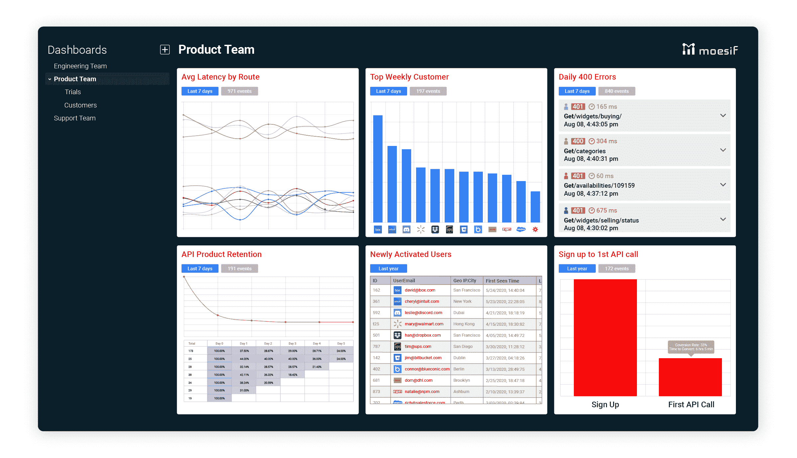

# 通过分析 API 负载释放业务洞察力

> 原文：<https://www.moesif.com/blog/business/analytics/Unlocking-Business-Insights-By-Analyzing-API-Payloads/>

API 现在是企业打破公司孤岛的事实上的方法，它支持内部部门和外部客户和合作伙伴之间的数据共享。根据 Cloud Elements，现在超过 50%的 B2B 协作发生在 API 上，并且还在继续增长。您的企业可以部署 API，通过让合作伙伴和客户以编程方式连接您的服务来实现自动化和数据共享，从而为他们提供额外的价值。同时，您的企业可以通过拼凑其他公司的 API 集合来构建新产品和服务。

API 正在成为现代企业连接供应商和客户的事实上的数字供应链。因此，流经 API 的数据很好地代表了企业的健康状况。然而，缺乏利用这些数据的工具。

如今，商业分析工具要么侧重于:

1.  数据库和仓库中的离线事务数据，如 Redshift 或 Snowflake
2.  Mixpanel 和 Amplitude 等工具中的在线使用指标，以了解消费者如何与 web 和移动界面进行交互。

这就为公司留下了一个缺口，这些公司不仅试图获得对其网络和移动资产的洞察，还试图获得对任何 API 驱动的数字资产的洞察，无论是合作伙伴集成、供应商 API 还是提供给客户的 API。随着 API 围绕 REST、JSON 和 GraphQL 等常见设计模式进行标准化，公司收集和分析这些数据变得更加容易，而无需构建复杂的定制解决方案。

## API 分析解决方案的架构

### 面向技术用户的基线 API 分析

首先，API 分析系统应该捕获关于 API 的基本信息，比如 HTTP 动词、路径或路由以及 HTTP 头。还应该跟踪其他元数据，如状态代码、身份验证信息和延迟。此类属性支持技术指标，如按端点细分的 90%延迟，并发现任何异常值。

### 将 API 分析扩展到业务用户

对于业务用户来说，仅仅跟踪性能和功能 API 度量是不够的。为了使 API 分析系统有用，请求需要与业务概念联系起来，例如 API 事务的含义、资金或价值流动的方向以及 API 的用户是谁。因为 API 本质上是技术性的，所以添加诸如事务描述和哪个团队拥有 API 之类的上下文是至关重要的。例如，如果我们要查看最大的客户正在使用的顶级端点，可能会进行如下的 *top k* 聚合:

| 端点 | 每日事件计数 |
| --- | --- |
| 获取/项目 | Five hundred and forty-five thousand four hundred and fifty-one |
| GET/items/:id/类别/ | Four hundred and fifty-four thousand one hundred and fifty-one |
| 帖子/评论 | Three thousand four hundred and eighty-eight |
| 过帐/采购 | One hundred and one |

然而，商业用户的 API 分析可以用简单的描述来标记 API 事务。如今，这可以通过流行的 API 标记语言(如 Swagger/OpenAPI)自动完成，生成如下所示的报告:

| 端点 | 每日事件计数 |
| --- | --- |
| 获取项目列表 | Five hundred and forty-five thousand four hundred and fifty-one |
| 获取项目类别列表 | Four hundred and fifty-four thousand one hundred and fifty-one |
| 创建评论 | Three thousand four hundred and eighty-eight |
| 创建采购 | One hundred and one |

### 分析请求和响应主体

捕获整个有效负载不仅可以深入了解哪些端点被调用或延迟时间，还可以了解 API 查询或发布到 API 的实际客户。这使得能够跟踪销售和订单等业务实体。还应该跟踪其他元数据，如状态代码、身份验证信息和延迟。下图显示了响应 JSON 中按“标签”字段分组的 API 调用数量，它们按客户名称分组。

<noscript></noscript>

通过查看网络上的实际数据，我们能够看到 API 何时以缺货作为标签或类型做出响应。

### 添加客户人口统计信息

通过在 Salesforce 和内部用户表等系统中提取客户信息，业务用户可以按照客户名称、员工数量和营销属性对 API 数据进行分割。这使得业务用户能够了解哪些类型的用户在最大程度上采用和成功使用 API，同时投资于推动结果的正确的销售和营销计划。例如，下图显示了按营销渠道细分的独特 API 用户。

<noscript></noscript>

## 商业用户如何利用 API 分析？

通过添加客户人口统计信息，设计良好的 API 分析系统可以回答以下问题:

*   跟踪客户从最初接触到完全激活/整合客户的过程，同时发现哪些营销举措推动了更高的激活率。
*   通过观察产品保持率来发现特定的 API 程序是否健康。
*   通过了解使用或不使用哪些 API 特性来规划更好的产品策略。
*   当一个新的帐户激活或有困难时进行监控，并先发制人任何艰难的讨论。

在下图中，我们能够跟踪顾客的旅程，了解他们在哪里下车。为此，我们需要定义一些标准，比如第一个 Hello World 的时间(T0)和有价值行动的时间(T2)

<noscript></noscript>

## 使 API 分析具有可操作性

为了具有可操作性，最终用户需要能够在达到特定标准时创建操作和工作流。例如，每当特定新用户的 API 流量发生变化时，客户经理或客户成功经理就可以创建一个警报。产品经理可以创建一个仪表板，显示关于唯一活跃用户和功能使用的各种指标，而首席营销官可能需要一个仪表板，显示哪些营销渠道驱动了最多的激活以及转化率趋势如何。这意味着 API 分析系统应该能够为每个使用服务的团队创建仪表板，包括销售、客户成功、支持、产品和营销。

<noscript></noscript>

## 部署 API 分析的障碍

虽然部署 API 分析会对部署 API 的组织的增长轨迹产生巨大影响，但组织需要考虑一些问题。

### 维修费用

高容量的 API 会给设计不良的分析系统带来沉重的负担。团队总是超额订阅，这意味着在创建不向客户公开的内部系统时会走捷径，无论是在可伸缩性、安全性还是两者上。

### 合规风险

分析系统可能会跟踪 PII 或受监管的敏感信息，如 GDPR 和 CCPA。在存储此类数据时，拥有正确的流程和工作流来终止和删除数据至关重要。此外，还应该有可靠的访问控制来保护用户数据。

### 易用性

虽然技术用户可以在 Splunk 和 Datadog 等 APM 工具中直接解析日志和挖掘时序指标，但如果他们被迫采用此类工具，业务用户的生产力将会下降。在这种情况下，工程和数据科学团队产生了额外的负担。自助分析对于任何重视敏捷开发和创新速度的组织来说都至关重要。